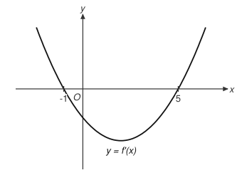
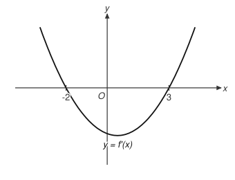
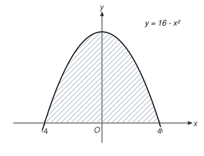
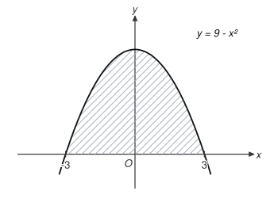
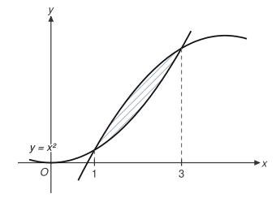
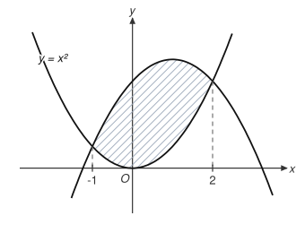

# REVIEW — mijeokbun1 문제 템플릿 v0.1

- 생성일: 2026-08-14 / 샘플 seed: 777
- 템플릿 70개 (생성 대상 70개, 그중 그림 자동 생성 9개 / 그림 스펙 없어 보류 0개)
- 각 템플릿마다 자동 생성 샘플 2문항을 보기·정답과 함께 표시했다. 수식은 LaTeX 원문이다.

검토 방법: 각 템플릿의 체크박스 4개를 확인해 주세요.

---

## T-M1-DIF-01-a — 평균변화율 계산

- 원본 카드: `M1-DIF-01` / 단원: 미분 / 난이도: 1
- **curriculum_check**: 구간 [a,b]에서의 평균변화율 (f(b)-f(a))/(b-a)는 미적분Ⅰ '미분계수' 도입 내용이며 이차함수만 사용한다.
- 파라미터:
  - `b`: int, 범위 [-4, 4], 제외 {0}
  - `p`: int, 범위 [-3, 2]
  - `q`: int, 범위 [-1, 4]
- 제약: `q > p` · `q - p != 1` · `p + q + b != 0` · `p + q + b != 1` · `p + q + b != -1`
- 오답 설계 (mistake_type):
  1. `2*p + b` — 평균변화율과 순간변화율을 혼동한다 → f'({p})를 답함
  2. `2*q + b` — 평균변화율과 순간변화율을 혼동한다 → f'({q})를 답함
  3. `(q - p) / (q^2 + b*q - (p^2 + b*p))` — 분자와 분모의 순서를 다르게 쓴다 → (b-a)/(f(b)-f(a))로 역수를 계산
  4. `q^2 + b*q - (p^2 + b*p)` — generic: 분모 (b-a)로 나누지 않고 f(b)-f(a)만 계산

### 샘플 1

> $f(x) = x^2 + 2x \text{ 에 대하여, 구간 } [1, 4] \text{ 에서의 평균변화율은?}$
>
> ① $21$
> ② $\dfrac{1}{7}$
> ③ $4$
> ④ $10$
> ⑤ $7$ **← 정답**
>
> 파라미터: `{"b":2,"p":1,"q":4}`

### 샘플 2

> $f(x) = x^2 + 4x \text{ 에 대하여, 구간 } [-3, 1] \text{ 에서의 평균변화율은?}$
>
> ① $8$
> ② $6$
> ③ $-2$
> ④ $\dfrac{1}{2}$
> ⑤ $2$ **← 정답**
>
> 파라미터: `{"b":4,"p":-3,"q":1}`

**검토 체크리스트**

- [ ] 유형 적절
- [ ] 파라미터 범위 적절
- [ ] 오답이 실제 학생 실수
- [ ] 교육과정 준수

---

## T-M1-DIF-01-b — 평균변화율 - 평균변화율과 미분계수가 같아지는 점

- 원본 카드: `M1-DIF-01` / 단원: 미분 / 난이도: 2
- **curriculum_check**: 이차함수에서 평균변화율 = f'(c)가 되는 c는 구간의 중점 — 평균변화율과 미분계수를 연결하는 미적분Ⅰ '미분계수' 대표 유형이다.
- 파라미터:
  - `b`: int, 범위 [-4, 4], 제외 {0}
  - `p`: int, 범위 [-4, 3], 제외 {0}
  - `q`: int, 범위 [-2, 5]
- 제약: `q > p`
- 오답 설계 (mistake_type):
  1. `p + q` — generic: 2로 나누는 과정을 누락
  2. `(q - p)/2` — generic: 구간의 중점 대신 반지름(폭의 절반)을 계산
  3. `q` — 평균변화율과 순간변화율을 혼동한다 → 구간 끝점을 답함
  4. `(p + q + b)/2` — generic: 계수 b가 소거됨을 놓치고 섞어 계산

### 샘플 1

> $f(x) = x^2 + x \text{ 에 대하여, 구간 } [1, 5] \text{ 에서의 평균변화율과 } f'(c) \text{ 의 값이 같을 때, 상수 } c \text{ 의 값은?}$
>
> ① $5$
> ② $6$
> ③ $3$ **← 정답**
> ④ $\dfrac{7}{2}$
> ⑤ $2$
>
> 파라미터: `{"b":1,"p":1,"q":5}`

### 샘플 2

> $f(x) = x^2 - 3x \text{ 에 대하여, 구간 } [2, 5] \text{ 에서의 평균변화율과 } f'(c) \text{ 의 값이 같을 때, 상수 } c \text{ 의 값은?}$
>
> ① $\dfrac{7}{2}$ **← 정답**
> ② $7$
> ③ $5$
> ④ $\dfrac{3}{2}$
> ⑤ $2$
>
> 파라미터: `{"b":-3,"p":2,"q":5}`

**검토 체크리스트**

- [ ] 유형 적절
- [ ] 파라미터 범위 적절
- [ ] 오답이 실제 학생 실수
- [ ] 교육과정 준수

---

## T-M1-DIF-02-a — 미분계수의 뜻 - 극한식 변형

- 원본 카드: `M1-DIF-02` / 단원: 미분 / 난이도: 2
- **curriculum_check**: 미분계수의 정의 lim (f(a+h)-f(a))/h 의 변형식 계산은 미적분Ⅰ '미분계수' 대표 유형이며 이차함수만 사용한다.
- 파라미터:
  - `b`: int, 범위 [-4, 4], 제외 {0}
  - `p`: int, 범위 [-3, 3], 제외 {0}
  - `a`: int, 범위 [-3, 3], 제외 {0, 1}
- 제약: `2*p + b != 0`
- 오답 설계 (mistake_type):
  1. `2*p + b` — 미분계수와 도함수를 구분하지 못한다 → 분자의 h 계수를 무시하고 f'({p})만 답함
  2. `0` — h를 약분하기 전에 h=0을 대입한다 → 0/0을 0으로 답함
  3. `2*a*p + b` — f(a+h)를 계산할 때 괄호를 빼먹는다 → 일차항에는 계수를 곱하지 않음
  4. `-(a*(2*p + b))` — generic: 부호 실수

### 샘플 1

> $f(x) = x^2 - 4x \text{ 일 때, } \lim_{h \to 0} \dfrac{f(1 - 2h) - f(1)}{h} \text{ 의 값은?}$
>
> ① $4$ **← 정답**
> ② $-4$
> ③ $-8$
> ④ $0$
> ⑤ $-2$
>
> 파라미터: `{"b":-4,"p":1,"a":-2}`

### 샘플 2

> $f(x) = x^2 + 3x \text{ 일 때, } \lim_{h \to 0} \dfrac{f(-3 - 2h) - f(-3)}{h} \text{ 의 값은?}$
>
> ① $15$
> ② $6$ **← 정답**
> ③ $-3$
> ④ $-6$
> ⑤ $0$
>
> 파라미터: `{"b":3,"p":-3,"a":-2}`

**검토 체크리스트**

- [ ] 유형 적절
- [ ] 파라미터 범위 적절
- [ ] 오답이 실제 학생 실수
- [ ] 교육과정 준수

---

## T-M1-DIF-02-b — 미분계수의 뜻 - x→a 형 정의식

- 원본 카드: `M1-DIF-02` / 단원: 미분 / 난이도: 2
- **curriculum_check**: f'(a) = lim_{x→a} (f(x)-f(a))/(x-a) 형태의 미분계수 정의는 미적분Ⅰ '미분계수' 기본 내용이다.
- 파라미터:
  - `p`: int, 범위 [-4, 4], 제외 {0, 1, 2, 3}
- 오답 설계 (mistake_type):
  1. `p^3` — 미분계수와 도함수를 구분하지 못한다 → 함수값 f({p})를 답함
  2. `0` — h를 약분하기 전에 h=0을 대입한다 → 0/0을 0으로 답함
  3. `3*p` — generic: 지수 처리 실수
  4. `6*p` — generic: 한 번 더 미분한 값을 답함

### 샘플 1

> $f(x) = x^3 \text{ 일 때, } \lim_{x \to -4} \dfrac{f(x) - f(-4)}{x + 4} \text{ 의 값은?}$
>
> ① $0$
> ② $48$ **← 정답**
> ③ $-24$
> ④ $-64$
> ⑤ $-12$
>
> 파라미터: `{"p":-4}`

### 샘플 2

> $f(x) = x^3 \text{ 일 때, } \lim_{x \to -1} \dfrac{f(x) - f(-1)}{x + 1} \text{ 의 값은?}$
>
> ① $-3$
> ② $-1$
> ③ $-6$
> ④ $0$
> ⑤ $3$ **← 정답**
>
> 파라미터: `{"p":-1}`

**검토 체크리스트**

- [ ] 유형 적절
- [ ] 파라미터 범위 적절
- [ ] 오답이 실제 학생 실수
- [ ] 교육과정 준수

---

## T-M1-DIF-03-a — 미분가능 조건과 미정계수

- 원본 카드: `M1-DIF-03` / 단원: 미분 / 난이도: 2
- **curriculum_check**: 미분가능하면 연속(함수값 일치)이고 좌우 미분계수도 일치해야 한다는 조건으로 미정계수를 구하는 것은 미적분Ⅰ '미분가능성과 연속' 대표 유형이다.
- 파라미터:
  - `a`: int, 범위 [-4, 4], 제외 {0}
  - `p`: int, 범위 [-3, 3], 제외 {0, 1}
- 제약: `2*p + a - p^2 != 0`
- 오답 설계 (mistake_type):
  1. `a + p^2` — 뾰족한 점의 좌우 기울기를 비교하지 않는다 → 기울기 조건 없이 b=a로 두고 연속 조건만 사용
  2. `p^2 + a*p` — 연속이면 무조건 미분가능하다고 생각한다 → 연속 조건의 값 f({p})를 그대로 답함
  3. `2*p + a` — generic: c를 0으로 두고 b만 계산
  4. `2*p + a + p^2` — generic: c의 부호 실수

### 샘플 1

> $f(x) = \begin{cases} x^2 + 4x & (x < 3) \\ bx + c & (x \ge 3) \end{cases} \text{ 가 } x = 3 \text{ 에서 미분가능할 때, } b + c \text{ 의 값은?}$
>
> ① $10$
> ② $19$
> ③ $21$
> ④ $13$
> ⑤ $1$ **← 정답**
>
> 파라미터: `{"a":4,"p":3}`

### 샘플 2

> $f(x) = \begin{cases} x^2 - 2x & (x < -1) \\ bx + c & (x \ge -1) \end{cases} \text{ 가 } x = -1 \text{ 에서 미분가능할 때, } b + c \text{ 의 값은?}$
>
> ① $-4$
> ② $-1$
> ③ $-3$
> ④ $-5$ **← 정답**
> ⑤ $3$
>
> 파라미터: `{"a":-2,"p":-1}`

**검토 체크리스트**

- [ ] 유형 적절
- [ ] 파라미터 범위 적절
- [ ] 오답이 실제 학생 실수
- [ ] 교육과정 준수

---

## T-M1-DIF-03-b — 미분가능성과 연속 - 절댓값 함수의 미분 불가능 점

- 원본 카드: `M1-DIF-03` / 단원: 미분 / 난이도: 2
- **curriculum_check**: |f(x)|는 f가 부호를 바꾸는 단순근에서 뾰족점(연속이지만 미분 불가능)이 생긴다 — |x|의 일반화로 미적분Ⅰ '미분가능성과 연속' 대표 유형이다.
- 파라미터:
  - `r`: int, 범위 [-3, 3], 제외 {0}
  - `s`: int, 범위 [-3, 3], 제외 {0}
- 제약: `r + s != 0`
- 오답 설계 (mistake_type):
  1. `r == s ? 2 : 0` — 뾰족한 점의 좌우 기울기를 비교하지 않는다 → 중근/서로 다른 근에서의 뾰족함 판정을 반대로 함
  2. `1` — generic: 미분 불가능한 점의 개수를 잘못 셈
  3. `3` — generic: 미분 불가능한 점의 개수를 잘못 셈
  4. `4` — 연속이면 무조건 미분가능하다고 생각한다 → 판정 기준 자체를 혼동

### 샘플 1

> $\text{함수 } f(x) = \left| x^2 + x - 2 \right| \text{ 가 미분가능하지 않은 } x \text{ 의 값의 개수는?}$
>
> ① $1$
> ② $0$
> ③ $3$
> ④ $4$
> ⑤ $2$ **← 정답**
>
> 파라미터: `{"r":1,"s":-2}`

### 샘플 2

> $\text{함수 } f(x) = \left| x^2 - x - 2 \right| \text{ 가 미분가능하지 않은 } x \text{ 의 값의 개수는?}$
>
> ① $3$
> ② $4$
> ③ $1$
> ④ $2$ **← 정답**
> ⑤ $0$
>
> 파라미터: `{"r":-1,"s":2}`

**검토 체크리스트**

- [ ] 유형 적절
- [ ] 파라미터 범위 적절
- [ ] 오답이 실제 학생 실수
- [ ] 교육과정 준수

---

## T-M1-DIF-04-a — 도함수의 뜻 - 정의로 구한 도함수의 값

- 원본 카드: `M1-DIF-04` / 단원: 미분 / 난이도: 1
- **curriculum_check**: 도함수의 정의 f'(x)=lim (f(x+h)-f(x))/h 와 다항함수 도함수 계산은 미적분Ⅰ '도함수' 기본 내용이다.
- 파라미터:
  - `b`: int, 범위 [-5, 5], 제외 {0}
  - `p`: int, 범위 [-3, 3], 제외 {0}
- 오답 설계 (mistake_type):
  1. `p^3 + b*p` — f'(a)와 f'(x)를 혼동한다 → 도함수 대신 함수값 f({p})를 계산
  2. `3*p^2` — generic: 일차항의 미분(상수 b)을 누락
  3. `6*p` — generic: 한 번 더 미분한 값을 답함
  4. `3*p^2 - b` — generic: 부호 실수

### 샘플 1

> $\text{도함수의 정의를 이용하여 } f(x) = x^3 - x \text{ 의 도함수 } f'(x) \text{ 를 구했을 때, } f'(-2) \text{ 의 값은?}$
>
> ① $12$
> ② $11$ **← 정답**
> ③ $-12$
> ④ $-6$
> ⑤ $13$
>
> 파라미터: `{"b":-1,"p":-2}`

### 샘플 2

> $\text{도함수의 정의를 이용하여 } f(x) = x^3 + 2x \text{ 의 도함수 } f'(x) \text{ 를 구했을 때, } f'(-1) \text{ 의 값은?}$
>
> ① $1$
> ② $-3$
> ③ $5$ **← 정답**
> ④ $3$
> ⑤ $-6$
>
> 파라미터: `{"b":2,"p":-1}`

**검토 체크리스트**

- [ ] 유형 적절
- [ ] 파라미터 범위 적절
- [ ] 오답이 실제 학생 실수
- [ ] 교육과정 준수

---

## T-M1-DIF-04-b — 도함수의 뜻 - 대칭형 극한식

- 원본 카드: `M1-DIF-04` / 단원: 미분 / 난이도: 2
- **curriculum_check**: 대칭형 극한식 (f(a+h)-f(a-h))/h = 2f'(a) 변형은 미적분Ⅰ '도함수/미분계수' 대표 유형이다.
- 파라미터:
  - `b`: int, 범위 [-4, 4], 제외 {0}
  - `p`: int, 범위 [-3, 3], 제외 {0}
- 제약: `2*p + b != 0`
- 오답 설계 (mistake_type):
  1. `2*p + b` — 정의식에서 h를 정리하기 전에 대입한다 → 분자가 2h·f'(p)임을 놓치고 f'(p)만 답함
  2. `0` — generic: 분자가 0으로 수렴한다고 보고 0으로 답함
  3. `4*p` — generic: 일차항 b의 기여를 누락
  4. `-2*(2*p + b)` — generic: 부호 실수

### 샘플 1

> $f(x) = x^2 + 3x \text{ 일 때, } \lim_{h \to 0} \dfrac{f(-1 + h) - f(-1 - h)}{h} \text{ 의 값은?}$
>
> ① $-4$
> ② $2$ **← 정답**
> ③ $1$
> ④ $-2$
> ⑤ $0$
>
> 파라미터: `{"b":3,"p":-1}`

### 샘플 2

> $f(x) = x^2 - x \text{ 일 때, } \lim_{h \to 0} \dfrac{f(1 + h) - f(1 - h)}{h} \text{ 의 값은?}$
>
> ① $4$
> ② $1$
> ③ $2$ **← 정답**
> ④ $0$
> ⑤ $-2$
>
> 파라미터: `{"b":-1,"p":1}`

**검토 체크리스트**

- [ ] 유형 적절
- [ ] 파라미터 범위 적절
- [ ] 오답이 실제 학생 실수
- [ ] 교육과정 준수

---

## T-M1-DIF-05-a — 다항함수의 미분법 - 삼차함수의 미분계수

- 원본 카드: `M1-DIF-05` / 단원: 미분 / 난이도: 1
- **curriculum_check**: (x^n)'=nx^{n-1}과 미분의 선형성은 미적분Ⅰ '다항함수의 미분법' 그 자체이며 삼차 이하 다항식만 사용한다.
- 파라미터:
  - `a`: int, 범위 [-3, 3], 제외 {0}
  - `b`: int, 범위 [-3, 3], 제외 {0}
  - `c`: int, 범위 [-4, 4], 제외 {0}
  - `d`: int, 범위 [-5, 5], 제외 {0}
  - `p`: int, 범위 [-3, 3], 제외 {0, 1}
- 오답 설계 (mistake_type):
  1. `3*a*p^2 + 2*b*p + c + d` — 상수항을 그대로 남긴다
  2. `a*p^2 + b*p + c` — 계수를 빠뜨린다 → 지수 n을 계수에 곱하지 않음
  3. `3*a*p^3 + 2*b*p^2 + c*p` — 지수를 1 줄이지 않는다
  4. `a*p^3 + b*p^2 + c*p + d` — generic: 미분하지 않고 f({p})를 계산

### 샘플 1

> $f(x) = -2x^3 - 2x^2 - 4x - 5 \text{ 일 때, } f'(-2) \text{ 의 값은?}$
>
> ① $11$
> ② $-25$
> ③ $-20$ **← 정답**
> ④ $40$
> ⑤ $-8$
>
> 파라미터: `{"a":-2,"b":-2,"c":-4,"d":-5,"p":-2}`

### 샘플 2

> $f(x) = 2x^3 - 3x^2 + 2x - 2 \text{ 일 때, } f'(2) \text{ 의 값은?}$
>
> ① $4$
> ② $28$
> ③ $6$
> ④ $14$ **← 정답**
> ⑤ $12$
>
> 파라미터: `{"a":2,"b":-3,"c":2,"d":-2,"p":2}`

**검토 체크리스트**

- [ ] 유형 적절
- [ ] 파라미터 범위 적절
- [ ] 오답이 실제 학생 실수
- [ ] 교육과정 준수

---

## T-M1-DIF-05-b — 다항함수의 미분법 - 미분계수 조건에서 계수 역산

- 원본 카드: `M1-DIF-05` / 단원: 미분 / 난이도: 1
- **curriculum_check**: 미분계수 값이 주어졌을 때 계수를 결정하는 역산은 미적분Ⅰ '다항함수의 미분법' 기본 유형이다. b를 먼저 정하고 f'(p)를 표시하는 역방향 설계.
- 파라미터:
  - `b`: int, 범위 [-6, 6], 제외 {0}
  - `p`: int, 범위 [-3, 4], 제외 {0, 1, 3}
- 오답 설계 (mistake_type):
  1. `2*p^2 + b` — 계수를 빠뜨린다 → x³의 도함수를 x²로 잘못 계산해 역산
  2. `3*p^2 + b - 3*p` — 지수를 1 줄이지 않는다 → 도함수를 3x로 잘못 계산해 역산
  3. `-b` — generic: 이항 과정의 부호 실수
  4. `3*p^2 + b - p^3` — generic: f({p})와 f'({p})를 혼동해 역산

### 샘플 1

> $f(x) = x^3 + bx \text{ 에 대하여 } f'(2) = 13 \text{ 일 때, 상수 } b \text{ 의 값은?}$
>
> ① $7$
> ② $5$
> ③ $9$
> ④ $-1$
> ⑤ $1$ **← 정답**
>
> 파라미터: `{"b":1,"p":2}`

### 샘플 2

> $f(x) = x^3 + bx \text{ 에 대하여 } f'(2) = 6 \text{ 일 때, 상수 } b \text{ 의 값은?}$
>
> ① $6$
> ② $2$
> ③ $-2$
> ④ $-6$ **← 정답**
> ⑤ $0$
>
> 파라미터: `{"b":-6,"p":2}`

**검토 체크리스트**

- [ ] 유형 적절
- [ ] 파라미터 범위 적절
- [ ] 오답이 실제 학생 실수
- [ ] 교육과정 준수

---

## T-M1-DIF-06-a — 접선의 방정식 - 접점에서의 접선의 y절편

- 원본 카드: `M1-DIF-06` / 단원: 다항함수의 미분법 / 난이도: 2
- **curriculum_check**: 이차함수(다항함수)의 도함수와 접선의 방정식 y-f(a)=f'(a)(x-a)는 미적분Ⅰ '다항함수의 미분법' 범위이며, 초월함수를 사용하지 않는다.
- 파라미터:
  - `b`: int, 범위 [-5, 5], 제외 {0}
  - `c`: int, 범위 [-6, 6], 제외 {0}
  - `t`: int, 범위 [-3, 3], 제외 {0, 1}
- 제약: `c - t^2 != (t^2 + b*t + c) * (1 - t)` · `c - t^2 != -(2*t + b) * t` · `c - t^2 != c + t^2` · `c - t^2 != b*t + c - t^2` · `abs(c - t^2) <= 30`
- 오답 설계 (mistake_type):
  1. `(t^2 + b*t + c) * (1 - t)` — f'(x)가 아니라 f(x)를 기울기로 쓴다 → 기울기를 f(t)로 잡고 y절편 f(t)-f(t)·t를 계산
  2. `-(2*t + b) * t` — 접점의 y좌표를 구하지 않는다 → y - 0 = f'(t)(x - t)로 세워 y절편 -f'(t)·t를 얻음
  3. `b*t + c - t^2` — generic: 도함수에서 b를 빠뜨려 기울기를 2t로 계산 (계수 실수)
  4. `c + t^2` — generic: y절편 c - t²의 부호를 반대로 계산 (부호 실수)

### 샘플 1

> $\text{곡선 } y = x^2 - 5x + 5 \text{ 위의 } x = -3 \text{ 인 점에서의 접선의 } y\text{절편은?}$
>
> ① $-33$
> ② $-4$ **← 정답**
> ③ $11$
> ④ $116$
> ⑤ $14$
>
> 파라미터: `{"b":-5,"c":5,"t":-3}`

### 샘플 2

> $\text{곡선 } y = x^2 + x + 2 \text{ 위의 } x = 3 \text{ 인 점에서의 접선의 } y\text{절편은?}$
>
> ① $-7$ **← 정답**
> ② $-28$
> ③ $-4$
> ④ $-21$
> ⑤ $11$
>
> 파라미터: `{"b":1,"c":2,"t":3}`

**검토 체크리스트**

- [ ] 유형 적절
- [ ] 파라미터 범위 적절
- [ ] 오답이 실제 학생 실수
- [ ] 교육과정 준수

---

## T-M1-DIF-06-b — 접선의 방정식 - 기울기가 주어진 접선의 접점

- 원본 카드: `M1-DIF-06` / 단원: 미분 / 난이도: 2
- **curriculum_check**: f'(x) = (주어진 기울기) 방정식으로 접점을 찾는 것은 미적분Ⅰ '접선의 방정식' 대표 유형이다. 접점 t를 먼저 정하고 기울기를 역산해 표시한다.
- 파라미터:
  - `b`: int, 범위 [-5, 5], 제외 {0}
  - `c`: int, 범위 [-6, 6], 제외 {0}
  - `t`: int, 범위 [-4, 4], 제외 {0}
- 제약: `2*t + b != 0` · `t != 2*t + b`
- 오답 설계 (mistake_type):
  1. `2*t + b` — f'(x)가 아니라 f(x)를 기울기로 쓴다 → 주어진 기울기 값을 그대로 좌표로 답함
  2. `t^2 + b*t + c` — 접점의 y좌표를 구하지 않는다 → x좌표와 y좌표를 혼동
  3. `t + b` — generic: 방정식 2x+b=m 풀이에서 2로 나누는 과정 실수
  4. `-t` — generic: 부호 실수

### 샘플 1

> $\text{곡선 } y = x^2 + 5x + 1 \text{ 의 접선 중 기울기가 } 1 \text{ 인 접선의 접점의 } x \text{좌표는?}$
>
> ① $1$
> ② $-5$
> ③ $2$
> ④ $-2$ **← 정답**
> ⑤ $3$
>
> 파라미터: `{"b":5,"c":1,"t":-2}`

### 샘플 2

> $\text{곡선 } y = x^2 - 5x - 6 \text{ 의 접선 중 기울기가 } -13 \text{ 인 접선의 접점의 } x \text{좌표는?}$
>
> ① $-13$
> ② $-9$
> ③ $-4$ **← 정답**
> ④ $30$
> ⑤ $4$
>
> 파라미터: `{"b":-5,"c":-6,"t":-4}`

**검토 체크리스트**

- [ ] 유형 적절
- [ ] 파라미터 범위 적절
- [ ] 오답이 실제 학생 실수
- [ ] 교육과정 준수

---

## T-M1-DIF-07-a — 증가와 감소 - 감소 구간의 길이

- 원본 카드: `M1-DIF-07` / 단원: 미분 / 난이도: 2
- **curriculum_check**: f'(x)<0인 구간에서 감소한다는 판정은 미적분Ⅰ '함수의 증가와 감소' 내용이며, f'는 이차함수로 인수분해는 선수과목 범위이다. (r+s는 짝수로 제한해 계수가 정수가 되도록 역방향 설계)
- 파라미터:
  - `r`: int, 범위 [-6, 4], 제외 {0}
  - `s`: int, 범위 [-4, 6], 제외 {0}
- 제약: `r < s` · `mod(r + s, 2) == 0` · `r + s != 0`
- 오답 설계 (mistake_type):
  1. `r + s` — generic: 두 경계값의 합을 계산
  2. `s` — f'(x)=0인 점만 찾고 부호표를 만들지 않는다 → 경계값 β 자체를 답함
  3. `r*s` — generic: f'(x)=0의 두 근의 곱을 계산
  4. `-(r + s)` — generic: 경계값 합의 부호 실수

### 샘플 1

> $\text{함수 } f(x) = x^3 - 12x^2 + 45x \text{ 가 구간 } (\alpha, \beta) \text{ 에서만 감소할 때, } \beta - \alpha \text{ 의 값은?}$
>
> ① $15$
> ② $8$
> ③ $5$
> ④ $-8$
> ⑤ $2$ **← 정답**
>
> 파라미터: `{"r":3,"s":5}`

### 샘플 2

> $\text{함수 } f(x) = x^3 - 3x^2 - 45x \text{ 가 구간 } (\alpha, \beta) \text{ 에서만 감소할 때, } \beta - \alpha \text{ 의 값은?}$
>
> ① $-15$
> ② $-2$
> ③ $2$
> ④ $8$ **← 정답**
> ⑤ $5$
>
> 파라미터: `{"r":-3,"s":5}`

**검토 체크리스트**

- [ ] 유형 적절
- [ ] 파라미터 범위 적절
- [ ] 오답이 실제 학생 실수
- [ ] 교육과정 준수

---

## T-M1-DIF-07-b — 증가와 감소 - 실수 전체에서 증가할 조건

- 원본 카드: `M1-DIF-07` / 단원: 미분 / 난이도: 3
- **curriculum_check**: 실수 전체에서 증가 ⇔ f'(x)=3x²+2ax+b ≥ 0 ⇔ 판별식 a² ≤ 3b — 미적분Ⅰ '함수의 증가와 감소'와 선수과목(이차부등식·판별식)의 결합 심화 유형이다. (b∈[2,8]에서 ⌊√(3b)⌋∈{2,3,4}이므로 삼항식으로 동치 표현)
- 파라미터:
  - `b`: int, 범위 [2, 8]
- 오답 설계 (mistake_type):
  1. `2*(b == 2 ? 2 : (b <= 5 ? 3 : 4))` — generic: a=0인 경우를 빠뜨리고 셈
  2. `2*(b == 2 ? 2 : (b <= 5 ? 3 : 4)) - 1` — 경계점 포함 여부를 문제 조건과 맞추지 않는다 → 판별식 D=0(접하는 경우)을 제외
  3. `(b == 2 ? 2 : (b <= 5 ? 3 : 4))` — generic: 음수 쪽 a를 빠뜨리고 셈
  4. `2*(b == 2 ? 2 : (b <= 5 ? 3 : 4)) + 3` — generic: 경계 밖 값을 포함해 셈

### 샘플 1

> $\text{함수 } f(x) = x^3 + ax^2 + 3x \text{ 가 실수 전체의 집합에서 증가하도록 하는 정수 } a \text{ 의 개수는?}$
>
> ① $3$
> ② $5$
> ③ $6$
> ④ $7$ **← 정답**
> ⑤ $9$
>
> 파라미터: `{"b":3}`

### 샘플 2

> $\text{함수 } f(x) = x^3 + ax^2 + 4x \text{ 가 실수 전체의 집합에서 증가하도록 하는 정수 } a \text{ 의 개수는?}$
>
> ① $9$
> ② $5$
> ③ $6$
> ④ $7$ **← 정답**
> ⑤ $3$
>
> 파라미터: `{"b":4}`

**검토 체크리스트**

- [ ] 유형 적절
- [ ] 파라미터 범위 적절
- [ ] 오답이 실제 학생 실수
- [ ] 교육과정 준수

---

## T-M1-DIF-08-a — 극대와 극소 - 삼차함수의 극댓값

- 원본 카드: `M1-DIF-08` / 단원: 미분 / 난이도: 2
- **curriculum_check**: f'의 부호가 +→-로 바뀌는 점에서 극대라는 판정과 삼차함수 극값 계산은 미적분Ⅰ '극대와 극소' 대표 유형이다. (f'(x)=3(x-r)(x-s)가 되도록 역방향 설계)
- 파라미터:
  - `r`: int, 범위 [-6, 4], 제외 {0}
  - `s`: int, 범위 [-4, 6], 제외 {0}
  - `d`: int, 범위 [-6, 6], 제외 {0}
- 제약: `r < s` · `mod(r + s, 2) == 0` · `r + s != 0` · `r^3 - 3*(r+s)/2*r^2 + 3*r*s*r + d != 0` · `r^3 - 3*(r+s)/2*r^2 + 3*r*s*r + d != r`
- 오답 설계 (mistake_type):
  1. `s^3 - 3*(r+s)/2*s^2 + 3*r*s*s + d` — generic: f'의 부호 변화 방향을 반대로 읽어 극솟값을 극댓값으로 착각
  2. `r` — 극값의 x좌표와 y값을 혼동한다 → 극대가 되는 x의 값을 답함
  3. `0` — 도함수에 대입한 값을 극값으로 쓴다 → f'(극대점)=0을 답함
  4. `r^3 - 3*(r+s)/2*r^2 + 3*r*s*r` — generic: 상수항 d를 누락

### 샘플 1

> $\text{함수 } f(x) = x^3 + 6x^2 - 15x + 1 \text{ 의 극댓값은?}$
>
> ① $0$
> ② $-5$
> ③ $100$
> ④ $101$ **← 정답**
> ⑤ $-7$
>
> 파라미터: `{"r":-5,"s":1,"d":1}`

### 샘플 2

> $\text{함수 } f(x) = x^3 + 12x^2 + 45x + 5 \text{ 의 극댓값은?}$
>
> ① $0$
> ② $-5$
> ③ $-45$ **← 정답**
> ④ $-49$
> ⑤ $-50$
>
> 파라미터: `{"r":-5,"s":-3,"d":5}`

**검토 체크리스트**

- [ ] 유형 적절
- [ ] 파라미터 범위 적절
- [ ] 오답이 실제 학생 실수
- [ ] 교육과정 준수

---

## T-M1-DIF-08-b — 극대와 극소 - 극값 조건에서 계수 역산

- 원본 카드: `M1-DIF-08` / 단원: 미분 / 난이도: 2
- **curriculum_check**: x=p에서 극값 ⇒ f'(p)=0 조건으로 미정계수를 구하는 것은 미적분Ⅰ '극대와 극소' 대표 유형이다. f''(p)≠0 제약으로 진짜 극값이 되도록 보장했다.
- 파라미터:
  - `a`: int, 범위 [-4, 4], 제외 {0}
  - `p`: int, 범위 [-3, 3], 제외 {0}
- 제약: `3*p + a != 0` · `3*p + 2*a != 0`
- 오답 설계 (mistake_type):
  1. `3*p^2 + 2*a*p` — generic: f'({p})=0 이항 과정의 부호 실수
  2. `-3*p^2 + 2*a*p` — generic: 일부 항만 부호를 바꿔 이항
  3. `-6*p - 2*a` — 도함수에 대입한 값을 극값으로 쓴다 → 이계도함수 조건과 혼동
  4. `-p^3 - a*p^2` — f'(x)=0이면 무조건 극값이 있다고 생각한다 → f({p})=0으로 잘못 세움

### 샘플 1

> $\text{함수 } f(x) = x^3 - x^2 + bx \text{ 가 } x = 3 \text{ 에서 극값을 가질 때, 상수 } b \text{ 의 값은?}$
>
> ① $-33$
> ② $-21$ **← 정답**
> ③ $-18$
> ④ $21$
> ⑤ $-16$
>
> 파라미터: `{"a":-1,"p":3}`

### 샘플 2

> $\text{함수 } f(x) = x^3 + 3x^2 + bx \text{ 가 } x = -3 \text{ 에서 극값을 가질 때, 상수 } b \text{ 의 값은?}$
>
> ① $0$
> ② $-9$ **← 정답**
> ③ $12$
> ④ $-45$
> ⑤ $9$
>
> 파라미터: `{"a":3,"p":-3}`

**검토 체크리스트**

- [ ] 유형 적절
- [ ] 파라미터 범위 적절
- [ ] 오답이 실제 학생 실수
- [ ] 교육과정 준수

---

## T-M1-DIF-09-a — 삼차함수 그래프와 도함수 - 도함수 그래프에서 극대점 읽기

- 원본 카드: `M1-DIF-09` / 단원: 미분 / 난이도: 2 / **그림 자동 생성(SVG)**
- **curriculum_check**: 도함수 그래프의 부호(+→-)에서 원함수의 극대를 읽는 것은 미적분Ⅰ '도함수의 활용' 내용이다. 그림은 f'(x)=(x-r)(x-s) 포물선을 파라미터에서 결정론적으로 SVG 렌더링한다.
- 파라미터:
  - `r`: int, 범위 [-4, 2], 제외 {0}
  - `s`: int, 범위 [-2, 5], 제외 {0}
- 제약: `r < s` · `r + s != 0`
- 오답 설계 (mistake_type):
  1. `s` — 도함수 그래프가 x축 위에 있으면 원래 함수가 증가한다는 연결을 놓친다 → 부호 해석이 뒤집혀 극소점을 답함
  2. `(r + s)/2` — generic: 포물선의 꼭짓점 x좌표를 답함
  3. `r + s` — 삼차함수 자체의 근과 도함수의 근을 혼동한다 → 근 관련 값을 조합해 답함
  4. `0` — generic: 원점으로 판단

### 샘플 1

> $\text{그림은 삼차함수 } y = f(x) \text{ 의 도함수 } y = f'(x) \text{ 의 그래프이다. } f(x) \text{ 가 극대가 되는 } x \text{ 의 값은?}$
>
> 
>
> ① $-1$ **← 정답**
> ② $4$
> ③ $2$
> ④ $5$
> ⑤ $0$
>
> 파라미터: `{"r":-1,"s":5}`

### 샘플 2

> $\text{그림은 삼차함수 } y = f(x) \text{ 의 도함수 } y = f'(x) \text{ 의 그래프이다. } f(x) \text{ 가 극대가 되는 } x \text{ 의 값은?}$
>
> 
>
> ① $-\dfrac{3}{2}$
> ② $-3$
> ③ $-4$ **← 정답**
> ④ $1$
> ⑤ $0$
>
> 파라미터: `{"r":-4,"s":1}`

**검토 체크리스트**

- [ ] 유형 적절
- [ ] 파라미터 범위 적절
- [ ] 오답이 실제 학생 실수
- [ ] 교육과정 준수

---

## T-M1-DIF-09-b — 삼차함수 그래프와 도함수 - 도함수 그래프에서 감소 구간 읽기

- 원본 카드: `M1-DIF-09` / 단원: 미분 / 난이도: 2 / **그림 자동 생성(SVG)**
- **curriculum_check**: f'(x)<0인 구간(도함수 그래프가 x축 아래)에서 f가 감소한다는 해석은 미적분Ⅰ '도함수의 활용' 내용이다. 그림은 f'=(x-r)(x-s) 포물선을 자동 렌더링한다.
- 파라미터:
  - `r`: int, 범위 [-4, 2], 제외 {0}
  - `s`: int, 범위 [-2, 5], 제외 {0}
- 제약: `r < s` · `r + s != 0`
- 오답 설계 (mistake_type):
  1. `r + s` — generic: 두 근의 합을 계산
  2. `s` — 도함수 그래프가 x축 위에 있으면 원래 함수가 증가한다는 연결을 놓친다 → 경계값 자체를 답함
  3. `(s - r)/2` — generic: 구간 길이의 절반을 계산
  4. `r*s` — 삼차함수 자체의 근과 도함수의 근을 혼동한다 → 근의 곱을 계산

### 샘플 1

> $\text{그림은 삼차함수 } y = f(x) \text{ 의 도함수 } y = f'(x) \text{ 의 그래프이다. } f(x) \text{ 가 구간 } (\alpha, \beta) \text{ 에서만 감소할 때, } \beta - \alpha \text{ 의 값은?}$
>
> 
>
> ① $3$
> ② $-5$
> ③ $4$
> ④ $6$ **← 정답**
> ⑤ $5$
>
> 파라미터: `{"r":-1,"s":5}`

### 샘플 2

> $\text{그림은 삼차함수 } y = f(x) \text{ 의 도함수 } y = f'(x) \text{ 의 그래프이다. } f(x) \text{ 가 구간 } (\alpha, \beta) \text{ 에서만 감소할 때, } \beta - \alpha \text{ 의 값은?}$
>
> 
>
> ① $3$
> ② $1$
> ③ $5$ **← 정답**
> ④ $\dfrac{5}{2}$
> ⑤ $-6$
>
> 파라미터: `{"r":-2,"s":3}`

**검토 체크리스트**

- [ ] 유형 적절
- [ ] 파라미터 범위 적절
- [ ] 오답이 실제 학생 실수
- [ ] 교육과정 준수

---

## T-M1-DIF-10-a — 방정식의 실근 개수 - 삼차방정식과 수평선

- 원본 카드: `M1-DIF-10` / 단원: 미분 / 난이도: 2
- **curriculum_check**: f(x)=k의 실근 개수를 극댓값·극솟값과 k의 비교로 판단하는 것은 미적분Ⅰ '방정식에의 활용' 대표 유형이다. (극값이 ±2a³이 되는 x³-3a²x 꼴로 역방향 설계)
- 파라미터:
  - `a`: choice, 선택지 {1, 2}
  - `k`: int, 범위 [-20, 20]
- 제약: `abs(k) != 2*a^3`
- 오답 설계 (mistake_type):
  1. `abs(k) < 2*a^3 ? 1 : 3` — 극댓값/극솟값이 아니라 극점의 x좌표와 비교한다 → 비교 방향이 뒤집혀 반대 결론
  2. `2` — 접하는 경우를 두 근으로 세거나 빠뜨린다 → 경계(접하는 경우)로 착각
  3. `0` — generic: 그래프 개형 판단 실패 (홀수차 방정식은 실근이 항상 존재)
  4. `4` — generic: 교점 개수 과대 계산 (삼차방정식의 실근은 최대 3개)

### 샘플 1

> $\text{방정식 } x^3 - 12x = -11 \text{ 의 서로 다른 실근의 개수는?}$
>
> ① $0$
> ② $2$
> ③ $4$
> ④ $3$ **← 정답**
> ⑤ $1$
>
> 파라미터: `{"a":2,"k":-11}`

### 샘플 2

> $\text{방정식 } x^3 - 3x = -20 \text{ 의 서로 다른 실근의 개수는?}$
>
> ① $1$ **← 정답**
> ② $0$
> ③ $4$
> ④ $3$
> ⑤ $2$
>
> 파라미터: `{"a":1,"k":-20}`

**검토 체크리스트**

- [ ] 유형 적절
- [ ] 파라미터 범위 적절
- [ ] 오답이 실제 학생 실수
- [ ] 교육과정 준수

---

## T-M1-DIF-10-b — 방정식의 실근 개수 - 세 실근을 갖는 정수 k의 개수

- 원본 카드: `M1-DIF-10` / 단원: 미분 / 난이도: 3
- **curriculum_check**: 세 실근 조건 ⇔ 극솟값 < 0 < 극댓값 ⇔ -2a³ < k < 2a³, 정수 개수 4a³-1 — 미적분Ⅰ '방정식에의 활용' 심화 유형이다.
- 파라미터:
  - `a`: choice, 선택지 {1, 2}
- 오답 설계 (mistake_type):
  1. `4*a^3 + 1` — 접하는 경우를 두 근으로 세거나 빠뜨린다 → 경계 k=±2a³(중근 발생)까지 포함해 셈
  2. `4*a^3` — generic: 한쪽 경계만 포함해 셈
  3. `2*a^3 - 1` — 극댓값/극솟값이 아니라 극점의 x좌표와 비교한다 → 범위를 절반만 잡음
  4. `2*a^3` — generic: 범위 계산 실수

### 샘플 1

> $\text{방정식 } x^3 - 3x - k = 0 \text{ 이 서로 다른 세 실근을 갖도록 하는 정수 } k \text{ 의 개수는?}$
>
> ① $3$ **← 정답**
> ② $2$
> ③ $4$
> ④ $1$
> ⑤ $5$
>
> 파라미터: `{"a":1}`

### 샘플 2

> $\text{방정식 } x^3 - 3x - k = 0 \text{ 이 서로 다른 세 실근을 갖도록 하는 정수 } k \text{ 의 개수는?}$
>
> ① $3$ **← 정답**
> ② $1$
> ③ $4$
> ④ $2$
> ⑤ $5$
>
> 파라미터: `{"a":1}`

**검토 체크리스트**

- [ ] 유형 적절
- [ ] 파라미터 범위 적절
- [ ] 오답이 실제 학생 실수
- [ ] 교육과정 준수

---

## T-M1-DIF-11-a — 부등식과 미분 - 항상 성립하는 상수의 최솟값

- 원본 카드: `M1-DIF-11` / 단원: 미분 / 난이도: 3
- **curriculum_check**: F(x)=x³-3a²x+k의 x≥0에서의 최솟값(x=a에서 -2a³+k)이 0 이상이 되도록 하는 조건은 미적분Ⅰ '부등식에의 활용' 대표 유형이다.
- 파라미터:
  - `a`: int, 범위 [1, 4]
- 오답 설계 (mistake_type):
  1. `-2*a^3` — 부등식 방향을 이항 과정에서 잘못 처리한다 → F(x)의 최솟값 자체를 답함
  2. `0` — 정의역 조건을 빠뜨린다 / 최솟값이 0 이상인지 확인하지 않는다 → x=0만 확인하고 k≥0으로 판단
  3. `a^3` — generic: 최솟값 계산의 계수 실수
  4. `3*a^3` — generic: 최솟값 계산의 계수 실수

### 샘플 1

> $x \ge 0 \text{ 인 모든 실수 } x \text{ 에 대하여 부등식 } x^3 - 48x + k \ge 0 \text{ 이 성립하도록 하는 실수 } k \text{ 의 최솟값은?}$
>
> ① $64$
> ② $0$
> ③ $-128$
> ④ $192$
> ⑤ $128$ **← 정답**
>
> 파라미터: `{"a":4}`

### 샘플 2

> $x \ge 0 \text{ 인 모든 실수 } x \text{ 에 대하여 부등식 } x^3 - 3x + k \ge 0 \text{ 이 성립하도록 하는 실수 } k \text{ 의 최솟값은?}$
>
> ① $3$
> ② $2$ **← 정답**
> ③ $0$
> ④ $-2$
> ⑤ $1$
>
> 파라미터: `{"a":1}`

**검토 체크리스트**

- [ ] 유형 적절
- [ ] 파라미터 범위 적절
- [ ] 오답이 실제 학생 실수
- [ ] 교육과정 준수

---

## T-M1-DIF-11-b — 부등식과 미분 - 모든 실수에서 성립하는 사차부등식

- 원본 카드: `M1-DIF-11` / 단원: 미분 / 난이도: 3
- **curriculum_check**: F(x)=x⁴-4a³x+c의 최솟값(F'=4x³-4a³=0 → x=a에서 c-3a⁴)이 0 이상일 조건 — 사차 다항함수 미분은 미적분Ⅰ '다항함수의 미분법' 범위이다.
- 파라미터:
  - `a`: int, 범위 [1, 3]
- 오답 설계 (mistake_type):
  1. `-3*a^4` — 부등식 방향을 이항 과정에서 잘못 처리한다 → 좌변의 최솟값 자체를 답함
  2. `a^4` — generic: 최솟값 위치 x=a 대입 계산 실수
  3. `4*a^4` — generic: 계수 실수
  4. `0` — 최솟값이 0 이상인지 확인하지 않는다 → x=0만 확인하고 판단

### 샘플 1

> $\text{모든 실수 } x \text{ 에 대하여 부등식 } x^4 - 108x + c \ge 0 \text{ 이 성립하도록 하는 실수 } c \text{ 의 최솟값은?}$
>
> ① $243$ **← 정답**
> ② $0$
> ③ $324$
> ④ $81$
> ⑤ $-243$
>
> 파라미터: `{"a":3}`

### 샘플 2

> $\text{모든 실수 } x \text{ 에 대하여 부등식 } x^4 - 108x + c \ge 0 \text{ 이 성립하도록 하는 실수 } c \text{ 의 최솟값은?}$
>
> ① $81$
> ② $243$ **← 정답**
> ③ $324$
> ④ $0$
> ⑤ $-243$
>
> 파라미터: `{"a":3}`

**검토 체크리스트**

- [ ] 유형 적절
- [ ] 파라미터 범위 적절
- [ ] 오답이 실제 학생 실수
- [ ] 교육과정 준수

---

## T-M1-DIF-12-a — 닫힌구간에서의 최댓값

- 원본 카드: `M1-DIF-12` / 단원: 미분 / 난이도: 2
- **curriculum_check**: 닫힌구간에서 최대·최소 후보(양 끝점과 f'=0인 내부 점)를 비교하는 것은 미적분Ⅰ '최대·최소에의 활용' 대표 유형이다.
- 파라미터:
  - `c`: int, 범위 [1, 3]
  - `d`: int, 범위 [-8, 8], 제외 {0}
- 제약: `2*c^3 + d != 2*c`
- 오답 설계 (mistake_type):
  1. `-2*c^3 + d` — 양 끝점의 함수값을 계산하지 않는다 → 내부 임계점 x={c}의 값만 검토해 답함
  2. `2*c` — 최댓값과 최댓값을 갖는 x를 혼동한다 → 최대가 되는 x값(오른쪽 끝점)을 답함
  3. `d` — generic: f(0)만 확인하고 답함
  4. `2*c^3 - d` — generic: 상수항 부호 실수

### 샘플 1

> $\text{닫힌구간 } [0, 6] \text{ 에서 함수 } f(x) = x^3 - 27x + 1 \text{ 의 최댓값은?}$
>
> ① $1$
> ② $-53$
> ③ $53$
> ④ $55$ **← 정답**
> ⑤ $6$
>
> 파라미터: `{"c":3,"d":1}`

### 샘플 2

> $\text{닫힌구간 } [0, 4] \text{ 에서 함수 } f(x) = x^3 - 12x + 2 \text{ 의 최댓값은?}$
>
> ① $4$
> ② $2$
> ③ $14$
> ④ $-14$
> ⑤ $18$ **← 정답**
>
> 파라미터: `{"c":2,"d":2}`

**검토 체크리스트**

- [ ] 유형 적절
- [ ] 파라미터 범위 적절
- [ ] 오답이 실제 학생 실수
- [ ] 교육과정 준수

---

## T-M1-DIF-12-b — 최대·최소 - 조건이 있는 두 양수의 곱의 최댓값 (활용)

- 원본 카드: `M1-DIF-12` / 단원: 미분 / 난이도: 3
- **curriculum_check**: y=3a-x를 대입해 g(x)=x²(3a-x)의 최댓값을 미분으로 구하는(x=2a에서 4a³) 최대·최소 활용 문제 — 미적분Ⅰ '최대·최소에의 활용' 대표 유형이다.
- 파라미터:
  - `a`: int, 범위 [1, 4]
- 오답 설계 (mistake_type):
  1. `27*a^3/8` — generic: x=y일 때 최대라고 착각하고 계산
  2. `2*a^3` — 구간 밖의 f'(x)=0인 점을 후보에 넣는다 → 임계점 계산 실수
  3. `3*a^3` — generic: 최댓값 계산의 계수 실수
  4. `a^3` — generic: 최댓값 계산의 계수 실수

### 샘플 1

> $\text{두 양수 } x, y \text{ 가 } x + y = 3 \text{ 를 만족시킬 때, } x^2 y \text{ 의 최댓값은?}$
>
> ① $1$
> ② $\dfrac{27}{8}$
> ③ $3$
> ④ $4$ **← 정답**
> ⑤ $2$
>
> 파라미터: `{"a":1}`

### 샘플 2

> $\text{두 양수 } x, y \text{ 가 } x + y = 3 \text{ 를 만족시킬 때, } x^2 y \text{ 의 최댓값은?}$
>
> ① $3$
> ② $1$
> ③ $\dfrac{27}{8}$
> ④ $4$ **← 정답**
> ⑤ $2$
>
> 파라미터: `{"a":1}`

**검토 체크리스트**

- [ ] 유형 적절
- [ ] 파라미터 범위 적절
- [ ] 오답이 실제 학생 실수
- [ ] 교육과정 준수

---

## T-M1-DIF-13-a — 속도와 가속도 - 위치 함수의 두 번 미분

- 원본 카드: `M1-DIF-13` / 단원: 미분 / 난이도: 1
- **curriculum_check**: 위치→속도→가속도로 미분을 두 번 적용하는 직선 운동은 미적분Ⅰ '속도와 가속도' 기본 유형이며 다항함수만 사용한다.
- 파라미터:
  - `b`: int, 범위 [-4, 4], 제외 {0}
  - `c`: int, 범위 [-5, 5], 제외 {0}
  - `p`: int, 범위 [1, 4]
- 오답 설계 (mistake_type):
  1. `3*p^2 + 2*b*p + c` — 가속도를 구할 때 한 번만 미분한다 → 속도 v({p})를 답함
  2. `p^3 + b*p^2 + c*p` — 위치 함수에 바로 t를 대입하고 속도를 구했다고 착각한다 → 위치 s({p})를 답함
  3. `6*p` — generic: 이차항의 미분(2b)을 누락
  4. `6*p - 2*b` — generic: 부호 실수

### 샘플 1

> $\text{수직선 위를 움직이는 점 } \mathrm{P} \text{ 의 시각 } t \text{ 에서의 위치가 } s(t) = t^3 + 4t^2 + t \text{ 일 때, } t = 3 \text{ 에서의 점 } \mathrm{P} \text{ 의 가속도는?}$
>
> ① $66$
> ② $10$
> ③ $52$
> ④ $18$
> ⑤ $26$ **← 정답**
>
> 파라미터: `{"b":4,"c":1,"p":3}`

### 샘플 2

> $\text{수직선 위를 움직이는 점 } \mathrm{P} \text{ 의 시각 } t \text{ 에서의 위치가 } s(t) = t^3 - t^2 + 2t \text{ 일 때, } t = 1 \text{ 에서의 점 } \mathrm{P} \text{ 의 가속도는?}$
>
> ① $3$
> ② $2$
> ③ $4$ **← 정답**
> ④ $6$
> ⑤ $8$
>
> 파라미터: `{"b":-1,"c":2,"p":1}`

**검토 체크리스트**

- [ ] 유형 적절
- [ ] 파라미터 범위 적절
- [ ] 오답이 실제 학생 실수
- [ ] 교육과정 준수

---

## T-M1-DIF-13-b — 속도와 가속도 - 운동 방향을 바꾸는 시각

- 원본 카드: `M1-DIF-13` / 단원: 미분 / 난이도: 2
- **curriculum_check**: 운동 방향이 바뀌는 시각 = v(t)=0이고 부호가 바뀌는 시각 — 미적분Ⅰ '속도와 가속도' 대표 유형. v(t)=3(t-r)(t-s)가 되도록 역방향 설계(r+s 짝수로 계수 정수 보장).
- 파라미터:
  - `r`: int, 범위 [1, 3]
  - `s`: int, 범위 [2, 6]
- 제약: `r < s` · `mod(r + s, 2) == 0`
- 오답 설계 (mistake_type):
  1. `s` — generic: 두 번째로 방향을 바꾸는 시각을 답함
  2. `(r + s)/2` — 가속도를 구할 때 한 번만 미분한다 → 가속도가 0이 되는 시각과 혼동
  3. `r*s` — generic: 두 시각의 곱을 계산
  4. `r + s` — generic: 두 시각의 합을 계산

### 샘플 1

> $\text{수직선 위를 움직이는 점 } \mathrm{P} \text{ 의 시각 } t \; (t > 0) \text{ 에서의 위치가 } s(t) = t^3 - 12t^2 + 36t \text{ 이다. 점 } \mathrm{P} \text{ 가 처음으로 운동 방향을 바꾸는 시각은?}$
>
> ① $4$
> ② $2$ **← 정답**
> ③ $8$
> ④ $6$
> ⑤ $12$
>
> 파라미터: `{"r":2,"s":6}`

### 샘플 2

> $\text{수직선 위를 움직이는 점 } \mathrm{P} \text{ 의 시각 } t \; (t > 0) \text{ 에서의 위치가 } s(t) = t^3 - 12t^2 + 45t \text{ 이다. 점 } \mathrm{P} \text{ 가 처음으로 운동 방향을 바꾸는 시각은?}$
>
> ① $5$
> ② $3$ **← 정답**
> ③ $8$
> ④ $15$
> ⑤ $4$
>
> 파라미터: `{"r":3,"s":5}`

**검토 체크리스트**

- [ ] 유형 적절
- [ ] 파라미터 범위 적절
- [ ] 오답이 실제 학생 실수
- [ ] 교육과정 준수

---

## T-M1-INT-01-a — 부정적분의 뜻 - F'(x)=f(x) 관계

- 원본 카드: `M1-INT-01` / 단원: 적분 / 난이도: 1
- **curriculum_check**: F'(x)=f(x)라는 부정적분(원시함수)의 정의는 미적분Ⅰ '부정적분' 도입 내용이며, F를 먼저 주고 f를 미분으로 얻는 역방향 설계로 심볼릭 적분 없이 정답을 계산한다.
- 파라미터:
  - `b`: int, 범위 [-3, 3], 제외 {0}
  - `c`: int, 범위 [-4, 4], 제외 {0}
  - `d`: int, 범위 [-5, 5], 제외 {0}
  - `p`: int, 범위 [1, 3]
- 오답 설계 (mistake_type):
  1. `p^3 + b*p^2 + c*p + d` — generic: F'=f 관계를 잊고 F({p})를 그대로 답함
  2. `p^3 + b*p^2 + c*p` — 부정적분에서 적분상수 C를 빠뜨린다 → 상수항만 뺀 F({p})를 답함
  3. `3*p^2 + 2*b*p` — generic: 일차항의 미분(상수 c) 누락
  4. `6*p + 2*b` — generic: 한 번 더 미분한 값을 답함

### 샘플 1

> $F(x) = x^3 - 3x^2 - 4x - 3 \text{ 가 함수 } f(x) \text{ 의 한 부정적분일 때, } f(3) \text{ 의 값은?}$
>
> ① $-15$
> ② $5$ **← 정답**
> ③ $9$
> ④ $12$
> ⑤ $-12$
>
> 파라미터: `{"b":-3,"c":-4,"d":-3,"p":3}`

### 샘플 2

> $F(x) = x^3 + 3x^2 + 2x + 2 \text{ 가 함수 } f(x) \text{ 의 한 부정적분일 때, } f(1) \text{ 의 값은?}$
>
> ① $6$
> ② $12$
> ③ $11$ **← 정답**
> ④ $9$
> ⑤ $8$
>
> 파라미터: `{"b":3,"c":2,"d":2,"p":1}`

**검토 체크리스트**

- [ ] 유형 적절
- [ ] 파라미터 범위 적절
- [ ] 오답이 실제 학생 실수
- [ ] 교육과정 준수

---

## T-M1-INT-01-b — 부정적분의 뜻 - 그래프가 지나는 점으로 적분상수 결정

- 원본 카드: `M1-INT-01` / 단원: 적분 / 난이도: 2
- **curriculum_check**: 부정적분의 적분상수 C를 그래프가 지나는 점 조건으로 결정하는 것은 미적분Ⅰ '부정적분' 대표 유형이다. 계수를 2a로 주어 원시함수가 정수 계수가 된다.
- 파라미터:
  - `a`: int, 범위 [-2, 2], 제외 {0}
  - `b`: int, 범위 [-4, 4], 제외 {0}
  - `p`: int, 범위 [-3, 3], 제외 {0}
  - `q`: int, 범위 [-3, 3]
  - `y0`: int, 범위 [-5, 5], 제외 {0}
- 제약: `q != p` · `a*(p + q) + b != 0` · `y0 - a*p^2 - b*p != 0` · `a*p^2 + b*p != 0`
- 오답 설계 (mistake_type):
  1. `a*q^2 + b*q` — 부정적분에서 적분상수 C를 빠뜨린다
  2. `a*q^2 + b*q + y0` — generic: 적분상수를 y좌표 값 그대로라고 착각
  3. `y0` — generic: 주어진 점의 y좌표를 그대로 답함
  4. `a*q^2 + b*q - a*p^2 - b*p` — generic: 지나는 점의 y좌표를 계산에서 누락

### 샘플 1

> $f(x) = 2x - 4 \text{ 의 한 부정적분 } F(x) \text{ 의 그래프가 점 } (-3, -5) \text{ 을 지날 때, } F(2) \text{ 의 값은?}$
>
> ① $-4$
> ② $-9$
> ③ $-5$
> ④ $-25$
> ⑤ $-30$ **← 정답**
>
> 파라미터: `{"a":1,"b":-4,"p":-3,"q":2,"y0":-5}`

### 샘플 2

> $f(x) = 2x - 4 \text{ 의 한 부정적분 } F(x) \text{ 의 그래프가 점 } (-1, 3) \text{ 을 지날 때, } F(-2) \text{ 의 값은?}$
>
> ① $10$ **← 정답**
> ② $3$
> ③ $12$
> ④ $7$
> ⑤ $15$
>
> 파라미터: `{"a":1,"b":-4,"p":-1,"q":-2,"y0":3}`

**검토 체크리스트**

- [ ] 유형 적절
- [ ] 파라미터 범위 적절
- [ ] 오답이 실제 학생 실수
- [ ] 교육과정 준수

---

## T-M1-INT-02-a — 다항함수의 부정적분 - 초기조건으로 상수 결정

- 원본 카드: `M1-INT-02` / 단원: 적분 / 난이도: 1
- **curriculum_check**: ∫x^n dx = x^{n+1}/(n+1)+C와 초기조건으로 C를 결정하는 것은 미적분Ⅰ '부정적분' 대표 유형이다. 계수를 3a, 2b로 주어 적분 결과가 정수 계수가 되도록 역방향 설계했다.
- 파라미터:
  - `a`: int, 범위 [-2, 2], 제외 {0}
  - `b`: int, 범위 [-3, 3], 제외 {0}
  - `c`: int, 범위 [-4, 4], 제외 {0}
  - `d`: int, 범위 [-5, 5], 제외 {0}
  - `p`: int, 범위 [2, 3]
- 제약: `2*a*p + b != 0`
- 오답 설계 (mistake_type):
  1. `(a + b + c)*p^3 + d` — 모든 항에 같은 지수를 적용한다 → 모든 항을 x³ 항으로 만들어 계산
  2. `a*p^3 + b*p^2 + c + d` — 상수항의 적분을 상수로 둔다 → ∫c dx = c로 계산
  3. `a*p^3 + b*p^2 + c*p` — C를 여러 개 붙이거나 아예 생략한다 → 초기조건 F(0)={d}를 사용하지 않음
  4. `3*a*p^3 + 2*b*p^2 + c*p + d` — generic: 계수를 새 지수로 나누지 않음

### 샘플 1

> $f(x) = -3x^2 - 2x - 4 \text{ 의 부정적분 } F(x) \text{ 가 } F(0) = 4 \text{ 를 만족시킬 때, } F(3) \text{ 의 값은?}$
>
> ① $-158$
> ② $-44$ **← 정답**
> ③ $-107$
> ④ $-48$
> ⑤ $-36$
>
> 파라미터: `{"a":-1,"b":-1,"c":-4,"d":4,"p":3}`

### 샘플 2

> $f(x) = 6x^2 - 4x + 4 \text{ 의 부정적분 } F(x) \text{ 가 } F(0) = 5 \text{ 를 만족시킬 때, } F(3) \text{ 의 값은?}$
>
> ① $113$
> ② $53$ **← 정답**
> ③ $48$
> ④ $45$
> ⑤ $143$
>
> 파라미터: `{"a":2,"b":-2,"c":4,"d":5,"p":3}`

**검토 체크리스트**

- [ ] 유형 적절
- [ ] 파라미터 범위 적절
- [ ] 오답이 실제 학생 실수
- [ ] 교육과정 준수

---

## T-M1-INT-02-b — 다항함수의 부정적분 - 도함수와 한 점의 값으로 함수 복원

- 원본 카드: `M1-INT-02` / 단원: 적분 / 난이도: 2
- **curriculum_check**: 도함수를 적분해 원함수를 복원하고 한 점의 값으로 상수를 결정하는 것은 미적분Ⅰ '부정적분' 대표 유형이다. 계수 6a, 2b로 정수 계수를 보장한다.
- 파라미터:
  - `a`: int, 범위 [-2, 2], 제외 {0}
  - `b`: int, 범위 [-3, 3], 제외 {0}
  - `p`: int, 범위 [-3, 3], 제외 {0}
  - `q`: int, 범위 [-3, 3]
  - `v`: int, 범위 [-6, 6], 제외 {0}
- 제약: `q != p` · `3*a*p + 2*b != 0` · `3*a*p^2 + 2*b*p != 0`
- 오답 설계 (mistake_type):
  1. `3*a*q^2 + 2*b*q` — C를 여러 개 붙이거나 아예 생략한다 → 조건 f({p})={v}를 사용하지 않음
  2. `3*a*q^2 + 2*b*q + v` — generic: 적분상수를 {v} 그대로라고 착각
  3. `6*a*q + 2*b` — generic: 적분하지 않고 f'({q})를 계산
  4. `v` — generic: 주어진 함수값을 그대로 답함

### 샘플 1

> $\text{함수 } f(x) \text{ 에 대하여 } f'(x) = 6x + 4 \text{ 이고 } f(3) = 3 \text{ 일 때, } f(-1) \text{ 의 값은?}$
>
> ① $-1$
> ② $3$
> ③ $-2$
> ④ $2$
> ⑤ $-37$ **← 정답**
>
> 파라미터: `{"a":1,"b":2,"p":3,"q":-1,"v":3}`

### 샘플 2

> $\text{함수 } f(x) \text{ 에 대하여 } f'(x) = 6x - 4 \text{ 이고 } f(1) = 6 \text{ 일 때, } f(3) \text{ 의 값은?}$
>
> ① $22$ **← 정답**
> ② $21$
> ③ $14$
> ④ $6$
> ⑤ $15$
>
> 파라미터: `{"a":1,"b":-2,"p":1,"q":3,"v":6}`

**검토 체크리스트**

- [ ] 유형 적절
- [ ] 파라미터 범위 적절
- [ ] 오답이 실제 학생 실수
- [ ] 교육과정 준수

---

## T-M1-INT-03-a — 정적분의 뜻 - 일차함수의 정적분 계산

- 원본 카드: `M1-INT-03` / 단원: 적분 / 난이도: 1
- **curriculum_check**: ∫_a^b f dx = F(b)-F(a) 계산은 미적분Ⅰ '정적분' 기본 내용이다. 피적분함수가 2x+b이므로 원시함수 x²+bx가 정수 계수로 떨어진다. 정적분값이 음수가 되도록 제약해 '넓이와 혼동' 오답이 의미를 갖는다.
- 파라미터:
  - `m`: int, 범위 [-2, 2], 제외 {0}
  - `n`: int, 범위 [1, 4]
  - `b`: int, 범위 [-8, -2]
- 제약: `n > m` · `m + b != 0` · `n^2 + b*n - (m^2 + b*m) < 0`
- 오답 설계 (mistake_type):
  1. `abs(n^2 + b*n - (m^2 + b*m))` — 정적분값과 넓이를 항상 같다고 생각한다 / F(a)-F(b)로 순서를 바꿔 계산한다 → 부호가 반대인 값을 답함
  2. `n^2 + b*n` — 아래끝과 위끝을 제대로 보지 않는다 → F(아래끝) 대입을 누락
  3. `m^2 + b*m` — generic: F(아래끝)만 계산
  4. `n^2 - m^2` — generic: 일차항({b}x)의 적분을 누락

### 샘플 1

> $\displaystyle\int_{-2}^{2} (2x - 8)\,dx \text{ 의 값은?}$
>
> ① $32$
> ② $0$
> ③ $-12$
> ④ $-32$ **← 정답**
> ⑤ $20$
>
> 파라미터: `{"m":-2,"n":2,"b":-8}`

### 샘플 2

> $\displaystyle\int_{-2}^{2} (2x - 5)\,dx \text{ 의 값은?}$
>
> ① $-6$
> ② $-20$ **← 정답**
> ③ $0$
> ④ $14$
> ⑤ $20$
>
> 파라미터: `{"m":-2,"n":2,"b":-5}`

**검토 체크리스트**

- [ ] 유형 적절
- [ ] 파라미터 범위 적절
- [ ] 오답이 실제 학생 실수
- [ ] 교육과정 준수

---

## T-M1-INT-03-b — 정적분의 뜻 - 이차함수의 정적분 계산

- 원본 카드: `M1-INT-03` / 단원: 적분 / 난이도: 1
- **curriculum_check**: 이차 다항함수의 정적분 계산(F(b)-F(a))은 미적분Ⅰ '정적분' 기본 내용이다. 계수 3, 2b로 원시함수가 정수 계수가 된다.
- 파라미터:
  - `p`: int, 범위 [1, 4]
  - `b`: int, 범위 [-4, 4], 제외 {0}
  - `c`: int, 범위 [-5, 5], 제외 {0}
- 제약: `p^3 + b*p^2 + c*p != 0`
- 오답 설계 (mistake_type):
  1. `3*p^2 + 2*b*p + c` — generic: 적분하지 않고 피적분함수에 위끝을 대입
  2. `p^3 + b*p^2 + c` — generic: 상수항의 적분(cx)을 상수 c로 둠
  3. `p^3 + b*p^2` — 아래끝과 위끝을 제대로 보지 않는다 → 상수항 적분을 누락
  4. `(3*p^2 + 2*b*p + c)*p` — generic: 피적분함수 값에 구간 길이를 곱함

### 샘플 1

> $\displaystyle\int_{0}^{4} \left( 3x^2 + 8x - 1 \right) dx \text{ 의 값은?}$
>
> ① $127$
> ② $124$ **← 정답**
> ③ $316$
> ④ $79$
> ⑤ $128$
>
> 파라미터: `{"p":4,"b":4,"c":-1}`

### 샘플 2

> $\displaystyle\int_{0}^{4} \left( 3x^2 - 8x + 1 \right) dx \text{ 의 값은?}$
>
> ① $0$
> ② $68$
> ③ $4$ **← 정답**
> ④ $17$
> ⑤ $1$
>
> 파라미터: `{"p":4,"b":-4,"c":1}`

**검토 체크리스트**

- [ ] 유형 적절
- [ ] 파라미터 범위 적절
- [ ] 오답이 실제 학생 실수
- [ ] 교육과정 준수

---

## T-M1-INT-04-a — 정적분의 기본 성질 - 구간 분할(가법성)

- 원본 카드: `M1-INT-04` / 단원: 다항함수의 적분법 / 난이도: 1
- **curriculum_check**: 정적분의 가법성 ∫_a^b = ∫_a^c + ∫_c^b 은 미적분Ⅰ '다항함수의 적분법 - 정적분의 성질' 범위이며, 적분 계산 자체를 요구하지 않아 치환·부분적분(미적분Ⅱ)이 개입하지 않는다.
- 파라미터:
  - `p`: int, 범위 [1, 4]
  - `q`: int, 범위 [2, 8]
  - `A`: int, 범위 [-9, 9], 제외 {0}
  - `B`: int, 범위 [-9, 9], 제외 {0}
- 제약: `q > p` · `A != B` · `B - A != A - B` · `B - A != A + B` · `B - A != B` · `B - A != -(A + B)`
- 오답 설계 (mistake_type):
  1. `A - B` — 구간을 나눌 때 순서를 틀린다 → ∫_p^q = ∫_0^p - ∫_0^q 로 순서를 뒤집어 계산
  2. `A + B` — 구간을 나눌 때 순서를 틀린다 → 가법성을 잘못 적용해 두 값을 그대로 더함
  3. `B` — generic: 구간 분할을 무시하고 ∫_0^q 값을 그대로 답으로 씀
  4. `-(A + B)` — generic: 두 값을 더한 뒤 부호를 반대로 계산 (부호 실수)

### 샘플 1

> $\text{함수 } f(x) \text{ 가 } \displaystyle\int_{0}^{2} f(x)\,dx = 7,\ \int_{0}^{8} f(x)\,dx = -9 \text{ 를 만족시킬 때, } \displaystyle\int_{2}^{8} f(x)\,dx \text{ 의 값은?}$
>
> ① $-16$ **← 정답**
> ② $2$
> ③ $-2$
> ④ $16$
> ⑤ $-9$
>
> 파라미터: `{"p":2,"q":8,"A":7,"B":-9}`

### 샘플 2

> $\text{함수 } f(x) \text{ 가 } \displaystyle\int_{0}^{1} f(x)\,dx = 3,\ \int_{0}^{3} f(x)\,dx = -4 \text{ 를 만족시킬 때, } \displaystyle\int_{1}^{3} f(x)\,dx \text{ 의 값은?}$
>
> ① $1$
> ② $-7$ **← 정답**
> ③ $7$
> ④ $-4$
> ⑤ $-1$
>
> 파라미터: `{"p":1,"q":3,"A":3,"B":-4}`

**검토 체크리스트**

- [ ] 유형 적절
- [ ] 파라미터 범위 적절
- [ ] 오답이 실제 학생 실수
- [ ] 교육과정 준수

---

## T-M1-INT-04-b — 정적분의 기본 성질 - 선형성(합·상수배)

- 원본 카드: `M1-INT-04` / 단원: 적분 / 난이도: 1
- **curriculum_check**: 정적분의 선형성 ∫(af+bg) = a∫f + b∫g 는 미적분Ⅰ '정적분의 성질' 그 자체이다.
- 파라미터:
  - `m`: int, 범위 [-1, 1]
  - `n`: int, 범위 [2, 4]
  - `A`: int, 범위 [-8, 8], 제외 {0}
  - `B`: int, 범위 [-8, 8], 제외 {0}
- 제약: `A != B` · `2*A != B` · `2*A != 3*B`
- 오답 설계 (mistake_type):
  1. `3*A + 2*B` — 상수배를 함수 안에 잘못 적용한다 → 빼기를 더하기로 처리
  2. `A - B` — 상수배를 함수 안에 잘못 적용한다 → 상수배를 무시
  3. `3*B - 2*A` — generic: 두 정적분 값을 바꿔 적용
  4. `A + B` — generic: 상수배와 부호를 모두 무시

### 샘플 1

> $\displaystyle\int_{-1}^{3} f(x)\,dx = -6,\quad \int_{-1}^{3} g(x)\,dx = 6 \text{ 일 때, } \displaystyle\int_{-1}^{3} \left( 3f(x) - 2g(x) \right) dx \text{ 의 값은?}$
>
> ① $0$
> ② $-6$
> ③ $-30$ **← 정답**
> ④ $30$
> ⑤ $-12$
>
> 파라미터: `{"m":-1,"n":3,"A":-6,"B":6}`

### 샘플 2

> $\displaystyle\int_{0}^{2} f(x)\,dx = 7,\quad \int_{0}^{2} g(x)\,dx = -7 \text{ 일 때, } \displaystyle\int_{0}^{2} \left( 3f(x) - 2g(x) \right) dx \text{ 의 값은?}$
>
> ① $14$
> ② $0$
> ③ $35$ **← 정답**
> ④ $7$
> ⑤ $-35$
>
> 파라미터: `{"m":0,"n":2,"A":7,"B":-7}`

**검토 체크리스트**

- [ ] 유형 적절
- [ ] 파라미터 범위 적절
- [ ] 오답이 실제 학생 실수
- [ ] 교육과정 준수

---

## T-M1-INT-05-a — 미분과 적분의 관계 - F'의 정적분

- 원본 카드: `M1-INT-05` / 단원: 적분 / 난이도: 2
- **curriculum_check**: ∫_a^b F'(x)dx = F(b)-F(a)라는 미적분의 기본정리는 미적분Ⅰ '미분과 적분의 관계' 그 자체이며, F를 먼저 주는 역방향 설계로 심볼릭 적분을 회피한다.
- 파라미터:
  - `b`: int, 범위 [-3, 3], 제외 {0}
  - `c`: int, 범위 [-4, 4], 제외 {0}
  - `m`: int, 범위 [-2, 2], 제외 {0}
  - `n`: int, 범위 [1, 4]
- 제약: `n > m` · `n^3 + b*n^2 + c*n - (m^3 + b*m^2 + c*m) != 0` · `m^3 + b*m^2 + c*m != 0`
- 오답 설계 (mistake_type):
  1. `m^3 + b*m^2 + c*m - (n^3 + b*n^2 + c*n)` — 원시함수에 아래끝을 먼저 대입한다 → F(m)-F(n)으로 계산
  2. `n^3 + b*n^2 + c*n` — generic: 아래끝 대입을 누락하고 F(위끝)만 계산
  3. `3*n^2 + 2*b*n + c - (3*m^2 + 2*b*m + c)` — 미분과 적분의 방향을 혼동한다 → F'를 적분하는 대신 F'에 끝값을 대입한 차를 계산
  4. `n^3 + b*n^2 + c*n + m^3 + b*m^2 + c*m` — generic: 두 값의 차 대신 합을 계산

### 샘플 1

> $F(x) = x^3 - 3x^2 - 2x \text{ 일 때, } \displaystyle\int_{-1}^{1} F'(x)\,dx \text{ 의 값은?}$
>
> ① $-12$
> ② $-4$
> ③ $2$
> ④ $-2$ **← 정답**
> ⑤ $-6$
>
> 파라미터: `{"b":-3,"c":-2,"m":-1,"n":1}`

### 샘플 2

> $F(x) = x^3 - 3x^2 + x \text{ 일 때, } \displaystyle\int_{-2}^{4} F'(x)\,dx \text{ 의 값은?}$
>
> ① $-2$
> ② $42$ **← 정답**
> ③ $0$
> ④ $-42$
> ⑤ $20$
>
> 파라미터: `{"b":-3,"c":1,"m":-2,"n":4}`

**검토 체크리스트**

- [ ] 유형 적절
- [ ] 파라미터 범위 적절
- [ ] 오답이 실제 학생 실수
- [ ] 교육과정 준수

---

## T-M1-INT-05-b — 미분과 적분의 관계 - 정적분으로 정의된 함수의 미분

- 원본 카드: `M1-INT-05` / 단원: 적분 / 난이도: 1
- **curriculum_check**: d/dx ∫_a^x f(t)dt = f(x) 라는 미분과 적분의 관계는 미적분Ⅰ 해당 단원의 핵심 그 자체이다.
- 파라미터:
  - `a`: int, 범위 [-2, 2], 제외 {0}
  - `b`: int, 범위 [-5, 5], 제외 {0}
  - `p`: int, 범위 [-3, 3], 제외 {0}
  - `q`: int, 범위 [-3, 3]
- 제약: `p != q` · `p^2 != q^2`
- 오답 설계 (mistake_type):
  1. `a*p^3 + b*p - (a*q^3 + b*q)` — 미분과 적분의 방향을 혼동한다 → g'({p}) 대신 g({p})를 계산
  2. `6*a*p` — generic: 한 번 더 미분한 값을 답함
  3. `3*a*q^2 + b` — 원시함수에 아래끝을 먼저 대입한다 → 아래끝 값을 대입
  4. `0` — 부정적분의 C를 정적분 계산에 그대로 남긴다 → 계산이 꼬여 0으로 답함

### 샘플 1

> $g(x) = \displaystyle\int_{0}^{x} \left( -3t^2 + 5 \right) dt \text{ 일 때, } g'(3) \text{ 의 값은?}$
>
> ① $-22$ **← 정답**
> ② $5$
> ③ $-18$
> ④ $-12$
> ⑤ $0$
>
> 파라미터: `{"a":-1,"b":5,"p":3,"q":0}`

### 샘플 2

> $g(x) = \displaystyle\int_{3}^{x} \left( 6t^2 + 5 \right) dt \text{ 일 때, } g'(-2) \text{ 의 값은?}$
>
> ① $-95$
> ② $59$
> ③ $0$
> ④ $29$ **← 정답**
> ⑤ $-24$
>
> 파라미터: `{"a":2,"b":5,"p":-2,"q":3}`

**검토 체크리스트**

- [ ] 유형 적절
- [ ] 파라미터 범위 적절
- [ ] 오답이 실제 학생 실수
- [ ] 교육과정 준수

---

## T-M1-INT-06-a — 정적분으로 정의된 함수 - 극대가 되는 x

- 원본 카드: `M1-INT-06` / 단원: 적분 / 난이도: 3
- **curriculum_check**: g(x)=∫_a^x f(t)dt에서 g'(x)=f(x)를 이용해 극값을 찾는 것은 미적분Ⅰ '정적분으로 정의된 함수' 대표 유형이며, g를 직접 적분하지 않아도 되는 역방향 설계다.
- 파라미터:
  - `r`: int, 범위 [-3, 2], 제외 {0}
  - `s`: int, 범위 [-2, 4], 제외 {0, 1}
  - `p`: int, 범위 [-4, 4]
- 제약: `r < s` · `p != r` · `p != s`
- 오답 설계 (mistake_type):
  1. `s` — 아래끝과 위끝이 뒤바뀐 경우 부호를 놓친다 → g'의 부호 판단이 뒤집혀 극소가 되는 x를 답함
  2. `p` — 적분 변수 t와 위끝 x를 혼동한다 → 아래끝 값을 답함
  3. `(r + s)/2` — generic: g'(x)의 꼭짓점 x좌표와 혼동
  4. `r*s` — generic: 두 근의 곱을 계산

### 샘플 1

> $g(x) = \displaystyle\int_{-4}^{x} (t - 2)(t - 3)\,dt \text{ 에 대하여, } g(x) \text{ 가 극대가 되는 } x \text{ 의 값은?}$
>
> ① $3$
> ② $-4$
> ③ $6$
> ④ $2$ **← 정답**
> ⑤ $\dfrac{5}{2}$
>
> 파라미터: `{"r":2,"s":3,"p":-4}`

### 샘플 2

> $g(x) = \displaystyle\int_{0}^{x} (t + 3)(t + 1)\,dt \text{ 에 대하여, } g(x) \text{ 가 극대가 되는 } x \text{ 의 값은?}$
>
> ① $0$
> ② $-3$ **← 정답**
> ③ $-1$
> ④ $-2$
> ⑤ $3$
>
> 파라미터: `{"r":-3,"s":-1,"p":0}`

**검토 체크리스트**

- [ ] 유형 적절
- [ ] 파라미터 범위 적절
- [ ] 오답이 실제 학생 실수
- [ ] 교육과정 준수

---

## T-M1-INT-06-b — 정적분으로 정의된 함수 - 극댓값과 극솟값의 차

- 원본 카드: `M1-INT-06` / 단원: 적분 / 난이도: 3
- **curriculum_check**: g'=(x-r)(x-s)이므로 극대(x=r)·극소(x=s)이고 그 차는 -∫_r^s g' dt = (s-r)³/6 — 정적분으로 정의된 함수의 극값 분석, 미적분Ⅰ 심화 유형이다.
- 파라미터:
  - `r`: int, 범위 [-3, 2], 제외 {0}
  - `s`: int, 범위 [-2, 4], 제외 {0}
  - `p`: int, 범위 [-4, 4]
- 제약: `r < s` · `p != r` · `p != s`
- 오답 설계 (mistake_type):
  1. `-(s - r)^3/6` — 아래끝과 위끝이 뒤바뀐 경우 부호를 놓친다 → 극솟값-극댓값으로 계산
  2. `(s - r)^3/3` — generic: 적분 계산의 계수 실수(2배)
  3. `0` — 적분 변수 t와 위끝 x를 혼동한다 → 극값의 차가 아래끝에 무관함을 이해 못하고 0으로 판단
  4. `(s - r)^3/2` — generic: 적분 계산의 계수 실수

### 샘플 1

> $g(x) = \displaystyle\int_{4}^{x} (t + 3)(t - 2)\,dt \text{ 의 극댓값과 극솟값의 차는?}$
>
> ① $\dfrac{125}{2}$
> ② $0$
> ③ $-\dfrac{125}{6}$
> ④ $\dfrac{125}{3}$
> ⑤ $\dfrac{125}{6}$ **← 정답**
>
> 파라미터: `{"r":-3,"s":2,"p":4}`

### 샘플 2

> $g(x) = \displaystyle\int_{-4}^{x} (t + 3)(t + 1)\,dt \text{ 의 극댓값과 극솟값의 차는?}$
>
> ① $0$
> ② $\dfrac{8}{3}$
> ③ $\dfrac{4}{3}$ **← 정답**
> ④ $-\dfrac{4}{3}$
> ⑤ $4$
>
> 파라미터: `{"r":-3,"s":-1,"p":-4}`

**검토 체크리스트**

- [ ] 유형 적절
- [ ] 파라미터 범위 적절
- [ ] 오답이 실제 학생 실수
- [ ] 교육과정 준수

---

## T-M1-INT-07-a — 넓이 구하기 - 곡선과 x축 사이

- 원본 카드: `M1-INT-07` / 단원: 적분 / 난이도: 2 / **그림 자동 생성(SVG)**
- **curriculum_check**: f(x)≤0인 구간에서 넓이 = -∫f dx 처리는 미적분Ⅰ '넓이' 기본 유형이며, x(x-a)는 [0,a]에서 항상 0 이하이므로 구간 분할이 필요 없는 형태로 설계했다. 그림은 곡선과 x축 사이 영역을 빗금으로 표시한다.
- 파라미터:
  - `a`: int, 범위 [2, 9]
- 오답 설계 (mistake_type):
  1. `-a^3/6` — 정적분값이 음수로 나왔는데 넓이로 그대로 쓴다
  2. `a^3/3` — generic: 넓이 계산에서 계수를 2배로 처리
  3. `a^3/2` — generic: x² 항의 적분 계수 실수
  4. `a^3/12` — generic: 넓이 계산에서 계수를 절반으로 처리

### 샘플 1

> $\text{곡선 } y = x(x - 4) \text{ 와 } x \text{축으로 둘러싸인 부분의 넓이는?}$
>
> 
>
> ① $\dfrac{64}{3}$
> ② $32$
> ③ $\dfrac{16}{3}$
> ④ $-\dfrac{32}{3}$
> ⑤ $\dfrac{32}{3}$ **← 정답**
>
> 파라미터: `{"a":4}`

### 샘플 2

> $\text{곡선 } y = x(x - 2) \text{ 와 } x \text{축으로 둘러싸인 부분의 넓이는?}$
>
> 
>
> ① $-\dfrac{4}{3}$
> ② $\dfrac{8}{3}$
> ③ $4$
> ④ $\dfrac{4}{3}$ **← 정답**
> ⑤ $\dfrac{2}{3}$
>
> 파라미터: `{"a":2}`

**검토 체크리스트**

- [ ] 유형 적절
- [ ] 파라미터 범위 적절
- [ ] 오답이 실제 학생 실수
- [ ] 교육과정 준수

---

## T-M1-INT-07-b — 넓이 구하기 - 위로 볼록한 포물선과 x축

- 원본 카드: `M1-INT-07` / 단원: 적분 / 난이도: 2 / **그림 자동 생성(SVG)**
- **curriculum_check**: x축 위쪽 영역의 넓이 = ∫(위 함수) — 대칭 포물선과 x축 사이 넓이는 미적분Ⅰ '넓이' 기본 유형이다. ∫_{-k}^{k}(k²-x²)dx = 4k³/3. 그림은 빗금 영역과 교점을 자동 렌더링한다.
- 파라미터:
  - `k`: int, 범위 [1, 4]
- 오답 설계 (mistake_type):
  1. `2*k^3/3` — generic: 반쪽 구간 [0, k]만 적분
  2. `8*k^3/3` — generic: 계수 실수(2배)
  3. `4*k^3` — generic: x³항 적분에서 3으로 나누는 과정을 누락
  4. `2*k^3` — 정적분값이 음수로 나왔는데 넓이로 그대로 쓴다 → 계산이 꼬인 값

### 샘플 1

> $\text{곡선 } y = 16 - x^2 \text{ 과 } x \text{축으로 둘러싸인 부분의 넓이는?}$
>
> 
>
> ① $\dfrac{128}{3}$
> ② $\dfrac{256}{3}$ **← 정답**
> ③ $256$
> ④ $128$
> ⑤ $\dfrac{512}{3}$
>
> 파라미터: `{"k":4}`

### 샘플 2

> $\text{곡선 } y = 9 - x^2 \text{ 과 } x \text{축으로 둘러싸인 부분의 넓이는?}$
>
> 
>
> ① $54$
> ② $72$
> ③ $36$ **← 정답**
> ④ $18$
> ⑤ $108$
>
> 파라미터: `{"k":3}`

**검토 체크리스트**

- [ ] 유형 적절
- [ ] 파라미터 범위 적절
- [ ] 오답이 실제 학생 실수
- [ ] 교육과정 준수

---

## T-M1-INT-08-a — 두 곡선 사이의 넓이 - 포물선과 직선

- 원본 카드: `M1-INT-08` / 단원: 적분 / 난이도: 2 / **그림 자동 생성(SVG)**
- **curriculum_check**: 구간에서 (위 함수 - 아래 함수)의 정적분으로 두 곡선 사이 넓이를 구하는 것은 미적분Ⅰ '두 곡선 사이의 넓이' 유형이다. 직선 계수를 교점 r, s로부터 역산해 교점이 항상 정수가 되도록 설계했다. 그림은 두 곡선 사이 영역을 빗금으로, 교점의 x좌표를 점선·눈금으로 표시한다.
- 파라미터:
  - `r`: int, 범위 [-3, 3], 제외 {0}
  - `s`: int, 범위 [-2, 4], 제외 {0}
- 제약: `r < s` · `r + s != 0` · `s - r >= 2`
- 오답 설계 (mistake_type):
  1. `-(s - r)^3/6` — 아래 함수에서 위 함수를 빼 음수 넓이가 나온다
  2. `(s - r)^3/3` — generic: 넓이 공식의 계수를 2배로 처리
  3. `(s - r)^3/2` — generic: 적분 계수 실수
  4. `(s + r)^3/6` — 교점을 구하지 않고 임의의 구간으로 적분한다 → 잘못된 교점으로 계산

### 샘플 1

> $\text{곡선 } y = x^2 \text{ 과 직선 } y = 2x + 3 \text{ 로 둘러싸인 부분의 넓이는?}$
>
> 
>
> ① $\dfrac{32}{3}$ **← 정답**
> ② $\dfrac{4}{3}$
> ③ $\dfrac{64}{3}$
> ④ $32$
> ⑤ $-\dfrac{32}{3}$
>
> 파라미터: `{"r":-1,"s":3}`

### 샘플 2

> $\text{곡선 } y = x^2 \text{ 과 직선 } y = -4x - 3 \text{ 로 둘러싸인 부분의 넓이는?}$
>
> 
>
> ① $-\dfrac{4}{3}$
> ② $-\dfrac{32}{3}$
> ③ $4$
> ④ $\dfrac{8}{3}$
> ⑤ $\dfrac{4}{3}$ **← 정답**
>
> 파라미터: `{"r":-3,"s":-1}`

**검토 체크리스트**

- [ ] 유형 적절
- [ ] 파라미터 범위 적절
- [ ] 오답이 실제 학생 실수
- [ ] 교육과정 준수

---

## T-M1-INT-08-b — 두 곡선 사이의 넓이 - 두 포물선 사이

- 원본 카드: `M1-INT-08` / 단원: 적분 / 난이도: 3 / **그림 자동 생성(SVG)**
- **curriculum_check**: 두 곡선의 차 -2(x-r)(x-s)를 교점 사이에서 적분하면 (s-r)³/3 — 두 포물선 사이 넓이는 미적분Ⅰ '두 곡선 사이의 넓이' 심화 유형이다. 계수를 교점 r, s에서 역산해 교점이 항상 정수다.
- 파라미터:
  - `r`: int, 범위 [-2, 2], 제외 {0}
  - `s`: int, 범위 [-1, 3], 제외 {0}
- 제약: `r < s` · `s - r >= 2` · `r + s != 0`
- 오답 설계 (mistake_type):
  1. `(s - r)^3/6` — generic: 두 이차항의 차가 2x²임을 놓치고 절반으로 계산
  2. `(s - r)^3/2` — generic: 적분 계수 실수
  3. `2*(s - r)^3/3` — 아래 함수에서 위 함수를 빼 음수 넓이가 나온다 → 보정 과정에서 2배로 계산
  4. `(s + r)^3/3` — 교점을 구하지 않고 임의의 구간으로 적분한다 → 잘못된 교점 사용

### 샘플 1

> $\text{곡선 } y = x^2 \text{ 과 곡선 } y = -x^2 + 8x - 6 \text{ 로 둘러싸인 부분의 넓이는?}$
>
> 
>
> ① $4$
> ② $\dfrac{8}{3}$ **← 정답**
> ③ $\dfrac{64}{3}$
> ④ $\dfrac{16}{3}$
> ⑤ $\dfrac{4}{3}$
>
> 파라미터: `{"r":1,"s":3}`

### 샘플 2

> $\text{곡선 } y = x^2 \text{ 과 곡선 } y = -x^2 + 2x + 4 \text{ 로 둘러싸인 부분의 넓이는?}$
>
> 
>
> ① $\dfrac{9}{2}$
> ② $18$
> ③ $\dfrac{27}{2}$
> ④ $\dfrac{1}{3}$
> ⑤ $9$ **← 정답**
>
> 파라미터: `{"r":-1,"s":2}`

**검토 체크리스트**

- [ ] 유형 적절
- [ ] 파라미터 범위 적절
- [ ] 오답이 실제 학생 실수
- [ ] 교육과정 준수

---

## T-M1-INT-09-a — 속도와 거리 - 방향이 바뀌는 운동의 이동 거리

- 원본 카드: `M1-INT-09` / 단원: 적분 / 난이도: 3 / **그림 자동 생성(SVG)**
- **curriculum_check**: 이동 거리 = ∫|v(t)|dt 를 v=0인 시각 기준으로 구간을 나눠 계산하는 것은 미적분Ⅰ '속도와 거리' 대표 유형이다. b를 짝수로 제한해 답이 항상 정수가 된다. 그림은 v(t) 그래프와 v=0이 되는 시각을 함께 제시한다.
- 파라미터:
  - `b`: choice, 선택지 {-2, -4, -6, -8}
  - `p`: int, 범위 [2, 8]
- 제약: `p > -b/2`
- 오답 설계 (mistake_type):
  1. `p^2 + b*p` — 위치 변화량과 이동 거리를 같은 것으로 생각한다 / 속도가 음수인 구간을 그대로 더해 거리가 줄어든다
  2. `p^2 + b*p - b^2/2` — v(t)=0인 시각을 찾지 않는다 → 방향이 바뀌는 구간 보정의 부호 실수
  3. `2*p + b` — generic: t={p}에서의 속도를 답함
  4. `p^2 - b*p + b^2/2` — generic: 부호 실수

### 샘플 1

> $\text{수직선 위를 움직이는 점 } \mathrm{P} \text{ 의 시각 } t \text{ 에서의 속도가 } v(t) = 2t - 6 \text{ 일 때, } t = 0 \text{ 에서 } t = 8 \text{ 까지 점 } \mathrm{P} \text{ 가 움직인 거리는?}$
>
> 
>
> ① $34$ **← 정답**
> ② $16$
> ③ $10$
> ④ $130$
> ⑤ $-2$
>
> 파라미터: `{"b":-6,"p":8}`

### 샘플 2

> $\text{수직선 위를 움직이는 점 } \mathrm{P} \text{ 의 시각 } t \text{ 에서의 속도가 } v(t) = 2t - 4 \text{ 일 때, } t = 0 \text{ 에서 } t = 3 \text{ 까지 점 } \mathrm{P} \text{ 가 움직인 거리는?}$
>
> 
>
> ① $2$
> ② $-11$
> ③ $5$ **← 정답**
> ④ $29$
> ⑤ $-3$
>
> 파라미터: `{"b":-4,"p":3}`

**검토 체크리스트**

- [ ] 유형 적절
- [ ] 파라미터 범위 적절
- [ ] 오답이 실제 학생 실수
- [ ] 교육과정 준수

---

## T-M1-INT-09-b — 속도와 거리 - 출발점으로 되돌아오는 시각

- 원본 카드: `M1-INT-09` / 단원: 적분 / 난이도: 2
- **curriculum_check**: 위치 = ∫₀ᵀ v dt = T² + bT = 0 에서 T = -b — 위치 변화량의 의미를 묻는 미적분Ⅰ '속도와 거리' 유형이다.
- 파라미터:
  - `b`: choice, 선택지 {-2, -4, -6, -8}
- 오답 설계 (mistake_type):
  1. `-b/2` — v(t)=0인 시각을 찾지 않는다 → 방향을 바꾸는 시각을 복귀 시각으로 착각
  2. `-2*b` — generic: 방정식 풀이의 계수 실수
  3. `b` — generic: 부호 실수
  4. `-3*b/2` — generic: 위치 계산 실수

### 샘플 1

> $\text{원점에서 출발하여 수직선 위를 움직이는 점 } \mathrm{P} \text{ 의 시각 } t \text{ 에서의 속도가 } v(t) = 2t - 8 \text{ 일 때, 점 } \mathrm{P} \text{ 가 다시 원점으로 돌아오는 시각은? } (t > 0)$
>
> ① $8$ **← 정답**
> ② $4$
> ③ $12$
> ④ $-8$
> ⑤ $16$
>
> 파라미터: `{"b":-8}`

### 샘플 2

> $\text{원점에서 출발하여 수직선 위를 움직이는 점 } \mathrm{P} \text{ 의 시각 } t \text{ 에서의 속도가 } v(t) = 2t - 2 \text{ 일 때, 점 } \mathrm{P} \text{ 가 다시 원점으로 돌아오는 시각은? } (t > 0)$
>
> ① $-2$
> ② $1$
> ③ $3$
> ④ $4$
> ⑤ $2$ **← 정답**
>
> 파라미터: `{"b":-2}`

**검토 체크리스트**

- [ ] 유형 적절
- [ ] 파라미터 범위 적절
- [ ] 오답이 실제 학생 실수
- [ ] 교육과정 준수

---

## T-M1-INT-10-a — 적분 조건과 미정계수 - 일차함수 결정

- 원본 카드: `M1-INT-10` / 단원: 적분 / 난이도: 2
- **curriculum_check**: 정적분 조건으로 연립방정식을 세워 미정계수를 결정하는 것은 미적분Ⅰ '정적분의 활용' 유형이다. f(x)=ax+b를 먼저 정하고 조건값을 역산하는 역방향 설계로 조건값이 항상 정수다(a는 짝수).
- 파라미터:
  - `a`: choice, 선택지 {-4, -2, 2, 4}
  - `b`: int, 범위 [-4, 4], 제외 {0}
  - `p`: int, 범위 [3, 5]
- 제약: `a != b` · `a/2 + b != 0` · `a + b != 0` · `a*p + b != 0`
- 오답 설계 (mistake_type):
  1. `p*(a/2 + b)` — 정적분 조건을 부정적분처럼 처리한다 → ∫₀¹f 값을 f(1)로 착각하고 비례 계산
  2. `2*a*p + 2*b` — 미정계수 하나를 구한 뒤 다른 조건을 확인하지 않는다 → 한 조건만으로 f를 2배 크게 결정
  3. `b*p + a` — generic: 기울기와 y절편을 바꿔 씀
  4. `a*p - b` — generic: 부호 실수

### 샘플 1

> $\text{일차함수 } f(x) \text{ 가 } \displaystyle\int_{0}^{1} f(x)\,dx = 3,\qquad \int_{0}^{2} f(x)\,dx = 10 \text{ 를 만족시킬 때, } f(3) \text{ 의 값은?}$
>
> ① $7$
> ② $9$
> ③ $11$
> ④ $13$ **← 정답**
> ⑤ $26$
>
> 파라미터: `{"a":4,"b":1,"p":3}`

### 샘플 2

> $\text{일차함수 } f(x) \text{ 가 } \displaystyle\int_{0}^{1} f(x)\,dx = -5,\qquad \int_{0}^{2} f(x)\,dx = -12 \text{ 를 만족시킬 때, } f(4) \text{ 의 값은?}$
>
> ① $-4$
> ② $-24$
> ③ $-20$
> ④ $-12$ **← 정답**
> ⑤ $-18$
>
> 파라미터: `{"a":-2,"b":-4,"p":4}`

**검토 체크리스트**

- [ ] 유형 적절
- [ ] 파라미터 범위 적절
- [ ] 오답이 실제 학생 실수
- [ ] 교육과정 준수

---

## T-M1-INT-10-b — 적분 조건과 미정계수 - 정적분 등식에서 상수 결정

- 원본 카드: `M1-INT-10` / 단원: 적분 / 난이도: 1
- **curriculum_check**: 정적분 값이 주어진 등식에서 미정계수를 구하는 것은 미적분Ⅰ '정적분' 기본 유형이다. k를 먼저 정하고 우변 값을 역산해 표시한다.
- 파라미터:
  - `a`: int, 범위 [2, 5]
  - `k`: int, 범위 [-5, 5], 제외 {0}
- 오답 설계 (mistake_type):
  1. `k*a` — 정적분 조건을 부정적분처럼 처리한다 → kx 항의 적분값을 k로 착각해 a로 나누지 않음
  2. `a + k` — generic: 방정식 풀이에서 a² 항 처리 실수
  3. `-k` — generic: 이항 부호 실수
  4. `k - a` — generic: 방정식 풀이 실수

### 샘플 1

> $\displaystyle\int_{0}^{3} (2x + k)\,dx = 12 \text{ 일 때, 상수 } k \text{ 의 값은?}$
>
> ① $-1$
> ② $4$
> ③ $-2$
> ④ $1$ **← 정답**
> ⑤ $3$
>
> 파라미터: `{"a":3,"k":1}`

### 샘플 2

> $\displaystyle\int_{0}^{4} (2x + k)\,dx = -4 \text{ 일 때, 상수 } k \text{ 의 값은?}$
>
> ① $-1$
> ② $-20$
> ③ $-5$ **← 정답**
> ④ $5$
> ⑤ $-9$
>
> 파라미터: `{"a":4,"k":-5}`

**검토 체크리스트**

- [ ] 유형 적절
- [ ] 파라미터 범위 적절
- [ ] 오답이 실제 학생 실수
- [ ] 교육과정 준수

---

## T-M1-INT-11-a — 정적분과 대칭성 - 홀함수·짝함수 분리

- 원본 카드: `M1-INT-11` / 단원: 적분 / 난이도: 2
- **curriculum_check**: 대칭구간에서 홀함수의 정적분은 0, 짝함수는 2∫₀ᵃ라는 성질은 미적분Ⅰ '정적분의 성질' 범위이다. b를 3의 배수로 제한해 정답이 항상 정수가 된다.
- 파라미터:
  - `a`: int, 범위 [1, 3]
  - `b`: choice, 선택지 {-6, -3, 3, 6}
  - `c`: int, 범위 [-4, 4], 제외 {0}
  - `d`: int, 범위 [-5, 5], 제외 {0}
- 제약: `2*b*a^3/3 + 2*d*a != 0`
- 오답 설계 (mistake_type):
  1. `0` — 다항식의 홀수차/짝수차 항을 잘못 분류한다 → 전부 홀함수로 취급해 0으로 답함
  2. `2*b*a^3/3 + 2*d*a + c*a^2` — 다항식의 홀수차/짝수차 항을 잘못 분류한다 → 홀함수 {c}x 항의 정적분이 0임을 놓침
  3. `b*a^3/3 + d*a` — generic: 짝함수의 2∫₀ᵃ에서 2배를 누락
  4. `a^4/2 + 2*b*a^3/3 + 2*d*a` — generic: 홀함수 x³ 항을 남겨 계산

### 샘플 1

> $\displaystyle\int_{-3}^{3} \left( x^3 - 6x^2 - 2x - 5 \right) dx \text{ 의 값은?}$
>
> ① $-69$
> ② $-156$
> ③ $0$
> ④ $-138$ **← 정답**
> ⑤ $-\dfrac{195}{2}$
>
> 파라미터: `{"a":3,"b":-6,"c":-2,"d":-5}`

### 샘플 2

> $\displaystyle\int_{-3}^{3} \left( x^3 - 3x^2 - 3x - 1 \right) dx \text{ 의 값은?}$
>
> ① $-87$
> ② $0$
> ③ $-60$ **← 정답**
> ④ $-\dfrac{39}{2}$
> ⑤ $-30$
>
> 파라미터: `{"a":3,"b":-3,"c":-3,"d":-1}`

**검토 체크리스트**

- [ ] 유형 적절
- [ ] 파라미터 범위 적절
- [ ] 오답이 실제 학생 실수
- [ ] 교육과정 준수

---

## T-M1-INT-11-b — 정적분과 대칭성 - 대칭구간 정적분이 0이 되는 조건

- 원본 카드: `M1-INT-11` / 단원: 적분 / 난이도: 2
- **curriculum_check**: 홀수차 항은 소거되고 ∫_{-2}^{2}(ax²+c)dx = 16a/3 + 4c = 0 → c = -4a/3 — 대칭성을 조건식으로 활용하는 미적분Ⅰ '정적분의 성질' 유형이다. a를 3의 배수로 제한해 답이 정수다.
- 파라미터:
  - `a`: choice, 선택지 {-6, -3, 3, 6}
  - `b`: int, 범위 [-4, 4], 제외 {0}
- 오답 설계 (mistake_type):
  1. `4*a/3` — generic: 이항 부호 실수
  2. `0` — 다항식의 홀수차/짝수차 항을 잘못 분류한다 → 모든 항이 소거된다고 착각
  3. `-8*a/3` — 구간이 대칭이 아닌데 대칭성을 적용한다 → 2∫₀² 의 2배 처리 실수
  4. `-a` — generic: 적분 계수 계산 실수

### 샘플 1

> $f(x) = x^3 + 3x^2 + 4x + c \text{ 에 대하여 } \displaystyle\int_{-2}^{2} f(x)\,dx = 0 \text{ 일 때, 상수 } c \text{ 의 값은?}$
>
> ① $-4$ **← 정답**
> ② $-3$
> ③ $0$
> ④ $4$
> ⑤ $-8$
>
> 파라미터: `{"a":3,"b":4}`

### 샘플 2

> $f(x) = x^3 + 6x^2 + 2x + c \text{ 에 대하여 } \displaystyle\int_{-2}^{2} f(x)\,dx = 0 \text{ 일 때, 상수 } c \text{ 의 값은?}$
>
> ① $-6$
> ② $-8$ **← 정답**
> ③ $-16$
> ④ $8$
> ⑤ $0$
>
> 파라미터: `{"a":6,"b":2}`

**검토 체크리스트**

- [ ] 유형 적절
- [ ] 파라미터 범위 적절
- [ ] 오답이 실제 학생 실수
- [ ] 교육과정 준수

---

## T-M1-LIM-01-a — 함수의 극한의 뜻 - 함수값과 극한값의 구분

- 원본 카드: `M1-LIM-01` / 단원: 함수의 극한과 연속 / 난이도: 1
- **curriculum_check**: x=a에서 함수값과 극한값이 다를 수 있다는 극한의 정의는 미적분Ⅰ '함수의 극한' 도입부 내용이며 일차함수만 사용한다.
- 파라미터:
  - `p`: int, 범위 [-4, 4]
  - `a`: int, 범위 [-5, 5], 제외 {0}
  - `m`: int, 범위 [-6, 6]
- 제약: `m != p + a` · `m != p` · `p + a != 0`
- 오답 설계 (mistake_type):
  1. `m` — 극한값과 함수값을 같은 것으로 생각한다 → f({p})의 값을 그대로 답함 (그래프에서 뚫린 점 위에 찍힌 점의 y값)
  2. `p` — x가 a에 가까워진다는 말과 x=a라는 말을 혼동한다 → x값 자체를 답함
  3. `a + m` — generic: 함수식의 상수와 함수값을 뒤섞어 계산
  4. `-(p + a)` — generic: 부호 실수

### 샘플 1

> $\text{함수 } f(x) \text{ 가 } x \ne -2 \text{ 일 때 } f(x) = x - 1 \text{ 이고 } f(-2) = -4 \text{ 으로 정의될 때, } \lim_{x \to -2} f(x) \text{ 의 값은?}$
>
> ① $-5$
> ② $3$
> ③ $-3$ **← 정답**
> ④ $-4$
> ⑤ $-2$
>
> 파라미터: `{"p":-2,"a":-1,"m":-4}`

### 샘플 2

> $\text{함수 } f(x) \text{ 가 } x \ne -3 \text{ 일 때 } f(x) = x + 1 \text{ 이고 } f(-3) = -1 \text{ 으로 정의될 때, } \lim_{x \to -3} f(x) \text{ 의 값은?}$
>
> ① $-1$
> ② $2$
> ③ $-3$
> ④ $0$
> ⑤ $-2$ **← 정답**
>
> 파라미터: `{"p":-3,"a":1,"m":-1}`

**검토 체크리스트**

- [ ] 유형 적절
- [ ] 파라미터 범위 적절
- [ ] 오답이 실제 학생 실수
- [ ] 교육과정 준수

---

## T-M1-LIM-01-b — 함수의 극한의 뜻 - 그래프에서 뚫린 점의 극한 읽기

- 원본 카드: `M1-LIM-01` / 단원: 함수의 극한과 연속 / 난이도: 1 / **그림 자동 생성(SVG)**
- **curriculum_check**: 뚫린 점(극한값)과 찍힌 점(함수값)을 구분해 읽는 것은 미적분Ⅰ '함수의 극한' 도입 개념 그 자체이며, 그림은 일차함수 그래프를 파라미터에서 결정론적으로 렌더링한다.
- 파라미터:
  - `p`: int, 범위 [-3, 3], 제외 {0}
  - `a`: int, 범위 [-4, 4], 제외 {0}
  - `m`: int, 범위 [-5, 5], 제외 {0}
- 제약: `m != p + a` · `p + a != 0` · `abs(m - (p + a)) >= 2`
- 오답 설계 (mistake_type):
  1. `2*(p + a)` — 극한값과 함수값을 같은 것으로 생각한다 → f({p})도 뚫린 점의 y값(극한값)으로 읽음
  2. `2*m` — 그래프에서 뚫린 점의 y값과 극한값을 헷갈린다 → 극한값도 찍힌 점의 y값으로 읽음
  3. `m` — generic: 뚫린 점 때문에 극한이 없다고 보고 함수값만 답함
  4. `p + a` — generic: 극한값만 계산하고 f({p})를 누락

### 샘플 1

> $\text{그림은 함수 } y = f(x) \text{ 의 그래프이다. } \lim_{x \to -2} f(x) + f(-2) \text{ 의 값은?}$
>
> 
>
> ① $5$
> ② $10$
> ③ $-8$
> ④ $-4$
> ⑤ $1$ **← 정답**
>
> 파라미터: `{"p":-2,"a":-2,"m":5}`

### 샘플 2

> $\text{그림은 함수 } y = f(x) \text{ 의 그래프이다. } \lim_{x \to -3} f(x) + f(-3) \text{ 의 값은?}$
>
> 
>
> ① $-6$
> ② $-8$ **← 정답**
> ③ $-3$
> ④ $-10$
> ⑤ $-5$
>
> 파라미터: `{"p":-3,"a":-2,"m":-3}`

**검토 체크리스트**

- [ ] 유형 적절
- [ ] 파라미터 범위 적절
- [ ] 오답이 실제 학생 실수
- [ ] 교육과정 준수

---

## T-M1-LIM-01-c — 함수의 극한의 뜻 - 극한의 기본 성질(곱)

- 원본 카드: `M1-LIM-01` / 단원: 함수의 극한과 연속 / 난이도: 1
- **curriculum_check**: 수렴하는 두 함수의 곱의 극한(극한의 기본 성질)은 미적분Ⅰ '함수의 극한' 기본 내용이다.
- 파라미터:
  - `p`: int, 범위 [-4, 4], 제외 {0, 1}
  - `L`: int, 범위 [-6, 6], 제외 {0, 1}
- 제약: `p*L != p + L`
- 오답 설계 (mistake_type):
  1. `L` — generic: 곱해진 x를 무시하고 f의 극한값만 답함
  2. `p + L` — generic: 곱 대신 합으로 계산
  3. `p` — x가 a에 가까워진다는 말과 x=a라는 말을 혼동한다 → x값만 답함
  4. `-p*L` — generic: 부호 실수

### 샘플 1

> $\lim_{x \to -2} f(x) = -5 \text{ 일 때, } \lim_{x \to -2} x f(x) \text{ 의 값은?}$
>
> ① $-5$
> ② $-7$
> ③ $-2$
> ④ $10$ **← 정답**
> ⑤ $-10$
>
> 파라미터: `{"p":-2,"L":-5}`

### 샘플 2

> $\lim_{x \to -4} f(x) = -5 \text{ 일 때, } \lim_{x \to -4} x f(x) \text{ 의 값은?}$
>
> ① $-9$
> ② $-20$
> ③ $-4$
> ④ $20$ **← 정답**
> ⑤ $-5$
>
> 파라미터: `{"p":-4,"L":-5}`

**검토 체크리스트**

- [ ] 유형 적절
- [ ] 파라미터 범위 적절
- [ ] 오답이 실제 학생 실수
- [ ] 교육과정 준수

---

## T-M1-LIM-02-a — 좌극한과 우극한 - 조각함수의 한쪽 극한 계산

- 원본 카드: `M1-LIM-02` / 단원: 함수의 극한과 연속 / 난이도: 2
- **curriculum_check**: 조각으로 정의된 일차함수의 좌극한·우극한 계산은 미적분Ⅰ '함수의 극한' 범위이며, 일차함수는 선수과목(공통수학) 개념이다.
- 파라미터:
  - `a`: int, 범위 [-5, 5], 제외 {0}
  - `b`: int, 범위 [-3, 3], 제외 {0}
  - `c`: int, 범위 [-5, 5], 제외 {0}
  - `p`: int, 범위 [-3, 3]
- 제약: `p + a != b*p + c` · `b*p + c != 0` · `p + a != 0`
- 오답 설계 (mistake_type):
  1. `(b*p + c) - (p + a)` — 조각함수에서 x=a일 때의 식을 좌우 접근식과 혼동한다 → 좌극한과 우극한을 반대로 계산
  2. `0` — 한쪽 값만 보고 극한값이 있다고 판단한다 → 좌극한과 우극한이 같다고 착각해 차를 0으로 답함
  3. `p + a` — generic: 좌극한 값만 계산하고 차를 구하지 않음
  4. `(p + a) + (b*p + c)` — generic: 차 대신 합을 계산

### 샘플 1

> $f(x) = \begin{cases} x - 3 & (x < -2) \\ 2x + 5 & (x \ge -2) \end{cases} \text{ 일 때, } \lim_{x \to -2^{-}} f(x) - \lim_{x \to -2^{+}} f(x) \text{ 의 값은?}$
>
> ① $6$
> ② $-5$
> ③ $-6$ **← 정답**
> ④ $0$
> ⑤ $-4$
>
> 파라미터: `{"a":-3,"b":2,"c":5,"p":-2}`

### 샘플 2

> $f(x) = \begin{cases} x + 2 & (x < 2) \\ -x - 3 & (x \ge 2) \end{cases} \text{ 일 때, } \lim_{x \to 2^{-}} f(x) - \lim_{x \to 2^{+}} f(x) \text{ 의 값은?}$
>
> ① $9$ **← 정답**
> ② $4$
> ③ $-9$
> ④ $0$
> ⑤ $-1$
>
> 파라미터: `{"a":2,"b":-1,"c":-3,"p":2}`

**검토 체크리스트**

- [ ] 유형 적절
- [ ] 파라미터 범위 적절
- [ ] 오답이 실제 학생 실수
- [ ] 교육과정 준수

---

## T-M1-LIM-02-b — 좌극한과 우극한 - 그래프에서 한쪽 극한 읽기

- 원본 카드: `M1-LIM-02` / 단원: 함수의 극한과 연속 / 난이도: 2 / **그림 자동 생성(SVG)**
- **curriculum_check**: 그래프의 열린 점/닫힌 점에서 좌극한·우극한을 읽는 것은 미적분Ⅰ '함수의 극한' 대표 유형이며, 그림은 조각 일차함수를 파라미터에서 결정론적으로 렌더링한다.
- 파라미터:
  - `a`: int, 범위 [-4, 4], 제외 {0}
  - `b`: choice, 선택지 {-2, -1, 1, 2}
  - `c`: int, 범위 [-4, 4]
  - `p`: int, 범위 [-2, 2], 제외 {0}
- 제약: `p + a != b*p + c` · `p + a != 0` · `b*p + c != 0` · `abs((p + a) - (b*p + c)) >= 2` · `b*p + c != 3*(p + a)` · `b*p + c != -(p + a)`
- 오답 설계 (mistake_type):
  1. `2*(p + a)` — 한쪽 값만 보고 극한값이 있다고 판단한다 → 좌극한 값을 양쪽 극한으로 사용
  2. `2*(b*p + c)` — 그래프에서 열린 점과 닫힌 점만 보고 좌우 흐름을 보지 않는다 → 닫힌 점의 값을 양쪽 극한으로 사용
  3. `(b*p + c) - (p + a)` — generic: 합 대신 차를 계산
  4. `p + a` — generic: 좌극한만 계산하고 우극한을 누락

### 샘플 1

> $\text{그림은 함수 } y = f(x) \text{ 의 그래프이다. } \lim_{x \to -1^{-}} f(x) + \lim_{x \to -1^{+}} f(x) \text{ 의 값은?}$
>
> 
>
> ① $-4$
> ② $2$ **← 정답**
> ③ $-2$
> ④ $8$
> ⑤ $6$
>
> 파라미터: `{"a":-1,"b":-1,"c":3,"p":-1}`

### 샘플 2

> $\text{그림은 함수 } y = f(x) \text{ 의 그래프이다. } \lim_{x \to -2^{-}} f(x) + \lim_{x \to -2^{+}} f(x) \text{ 의 값은?}$
>
> 
>
> ① $-6$
> ② $-3$
> ③ $4$
> ④ $-2$ **← 정답**
> ⑤ $2$
>
> 파라미터: `{"a":-1,"b":1,"c":3,"p":-2}`

**검토 체크리스트**

- [ ] 유형 적절
- [ ] 파라미터 범위 적절
- [ ] 오답이 실제 학생 실수
- [ ] 교육과정 준수

---

## T-M1-LIM-02-c — 좌극한과 우극한 - 절댓값 분모의 한쪽 극한

- 원본 카드: `M1-LIM-02` / 단원: 함수의 극한과 연속 / 난이도: 2
- **curriculum_check**: 절댓값이 있는 식의 좌·우극한 계산은 미적분Ⅰ '함수의 극한' 유형이며 합차공식 인수분해는 선수과목 범위이다.
- 파라미터:
  - `p`: int, 범위 [-5, 5], 제외 {0}
- 오답 설계 (mistake_type):
  1. `-2*p` — 한쪽 값만 보고 극한값이 있다고 판단한다 → 절댓값 부호 처리가 뒤집혀 좌극한 값을 답함
  2. `0` — generic: 0/0꼴을 0으로 답함
  3. `p` — generic: 부분 약분 후 대입
  4. `4*p` — generic: 좌·우극한의 차를 답함

### 샘플 1

> $f(x) = \dfrac{x^2 - 25}{\left| x + 5 \right|} \text{ 일 때, } \lim_{x \to -5^{+}} f(x) \text{ 의 값은?}$
>
> ① $0$
> ② $-20$
> ③ $-10$ **← 정답**
> ④ $10$
> ⑤ $-5$
>
> 파라미터: `{"p":-5}`

### 샘플 2

> $f(x) = \dfrac{x^2 - 25}{\left| x - 5 \right|} \text{ 일 때, } \lim_{x \to 5^{+}} f(x) \text{ 의 값은?}$
>
> ① $20$
> ② $-10$
> ③ $10$ **← 정답**
> ④ $5$
> ⑤ $0$
>
> 파라미터: `{"p":5}`

**검토 체크리스트**

- [ ] 유형 적절
- [ ] 파라미터 범위 적절
- [ ] 오답이 실제 학생 실수
- [ ] 교육과정 준수

---

## T-M1-LIM-03-a — 대입으로 구하는 극한 - 다항함수

- 원본 카드: `M1-LIM-03` / 단원: 함수의 극한과 연속 / 난이도: 1
- **curriculum_check**: 다항함수의 연속성을 이용해 극한을 대입으로 구하는 것은 미적분Ⅰ '함수의 극한' 기본 내용이며 이차식만 사용한다.
- 파라미터:
  - `p`: int, 범위 [-3, 3], 제외 {0}
  - `b`: int, 범위 [-5, 5], 제외 {0}
  - `c`: int, 범위 [-6, 6], 제외 {0}
- 제약: `p + b != 0` · `p^2 + b*p + c != 0`
- 오답 설계 (mistake_type):
  1. `c` — generic: x→0으로 잘못 보고 상수항만 답함
  2. `p^2 + b*p` — generic: 상수항 누락
  3. `-(p^2 + b*p + c)` — 무조건 인수분해부터 하려고 한다 / 대입해도 되는 문제를 복잡하게 푼다 → 불필요한 식 변형 과정에서 부호가 뒤집힘
  4. `p^2 - b*p + c` — generic: 일차항 부호 실수

### 샘플 1

> $\lim_{x \to -1} \left( x^2 + 5x - 3 \right) \text{ 의 값은?}$
>
> ① $3$
> ② $-3$
> ③ $7$
> ④ $-4$
> ⑤ $-7$ **← 정답**
>
> 파라미터: `{"p":-1,"b":5,"c":-3}`

### 샘플 2

> $\lim_{x \to -2} \left( x^2 - x + 1 \right) \text{ 의 값은?}$
>
> ① $-7$
> ② $7$ **← 정답**
> ③ $3$
> ④ $6$
> ⑤ $1$
>
> 파라미터: `{"p":-2,"b":-1,"c":1}`

**검토 체크리스트**

- [ ] 유형 적절
- [ ] 파라미터 범위 적절
- [ ] 오답이 실제 학생 실수
- [ ] 교육과정 준수

---

## T-M1-LIM-03-b — 대입으로 구하는 극한 - 유리함수(분모 0 아님)

- 원본 카드: `M1-LIM-03` / 단원: 함수의 극한과 연속 / 난이도: 1
- **curriculum_check**: 분모가 0이 되지 않는 유리식의 극한은 연속성에 의한 대입으로 구한다 — 미적분Ⅰ '함수의 극한' 기본 내용.
- 파라미터:
  - `p`: int, 범위 [-3, 3]
  - `b`: int, 범위 [-4, 4], 제외 {0}
  - `c`: int, 범위 [-5, 5], 제외 {0}
  - `d`: int, 범위 [-4, 4], 제외 {0}
- 제약: `p + d != 0` · `p + d != 1` · `p + d != -1` · `p != d` · `p^3 + b*p + c != 0`
- 오답 설계 (mistake_type):
  1. `p^3 + b*p + c` — generic: 분모를 무시하고 분자에만 대입
  2. `(p^3 + b*p + c)*(p + d)` — generic: 나눗셈 대신 곱셈으로 계산
  3. `0` — 무조건 인수분해부터 하려고 한다 → 0/0꼴로 착각해 0으로 답함
  4. `(p^3 + b*p + c)/(p - d)` — generic: 분모 상수의 부호 실수

### 샘플 1

> $\lim_{x \to 0} \dfrac{x^3 + 3x - 1}{x - 3} \text{ 의 값은?}$
>
> ① $\dfrac{1}{3}$ **← 정답**
> ② $0$
> ③ $3$
> ④ $-\dfrac{1}{3}$
> ⑤ $-1$
>
> 파라미터: `{"p":0,"b":3,"c":-1,"d":-3}`

### 샘플 2

> $\lim_{x \to -3} \dfrac{x^3 + 4x + 5}{x + 1} \text{ 의 값은?}$
>
> ① $\dfrac{17}{2}$
> ② $68$
> ③ $17$ **← 정답**
> ④ $0$
> ⑤ $-34$
>
> 파라미터: `{"p":-3,"b":4,"c":5,"d":1}`

**검토 체크리스트**

- [ ] 유형 적절
- [ ] 파라미터 범위 적절
- [ ] 오답이 실제 학생 실수
- [ ] 교육과정 준수

---

## T-M1-LIM-04-a — 0/0꼴 극한 - 합차공식 약분

- 원본 카드: `M1-LIM-04` / 단원: 함수의 극한과 연속 / 난이도: 1
- **curriculum_check**: 0/0꼴 극한의 합차공식 인수분해는 미적분Ⅰ '함수의 극한' 핵심 유형이며, 합차공식은 선수과목 공통수학Ⅰ 개념이다.
- 파라미터:
  - `p`: int, 범위 [-8, 8], 제외 {0, 1, 2}
- 오답 설계 (mistake_type):
  1. `0` — 0/0을 0이라고 생각한다 → 분자에 그대로 대입해 0이라고 답함
  2. `p` — 약분하기 전 인수분해를 제대로 하지 않는다 → x²/x만 부분 약분하고 x→p를 대입
  3. `p^2` — 극한에서의 약분과 함수값 계산을 혼동한다 → 분자의 x²에만 대입한 값을 답함
  4. `-2*p` — generic: 부호 실수

### 샘플 1

> $\lim_{x \to 8} \dfrac{x^2 - 64}{x - 8} \text{ 의 값은?}$
>
> ① $8$
> ② $-16$
> ③ $16$ **← 정답**
> ④ $0$
> ⑤ $64$
>
> 파라미터: `{"p":8}`

### 샘플 2

> $\lim_{x \to -5} \dfrac{x^2 - 25}{x + 5} \text{ 의 값은?}$
>
> ① $-5$
> ② $-10$ **← 정답**
> ③ $10$
> ④ $0$
> ⑤ $25$
>
> 파라미터: `{"p":-5}`

**검토 체크리스트**

- [ ] 유형 적절
- [ ] 파라미터 범위 적절
- [ ] 오답이 실제 학생 실수
- [ ] 교육과정 준수

---

## T-M1-LIM-04-b — 0/0꼴 극한 - 세제곱 차 인수분해

- 원본 카드: `M1-LIM-04` / 단원: 함수의 극한과 연속 / 난이도: 2
- **curriculum_check**: 세제곱 차 인수분해 a³-b³=(a-b)(a²+ab+b²)는 선수과목 공통수학Ⅰ 범위이며, 이를 이용한 0/0꼴 극한은 미적분Ⅰ '함수의 극한' 유형이다.
- 파라미터:
  - `p`: int, 범위 [-4, 4], 제외 {0, 1}
- 오답 설계 (mistake_type):
  1. `0` — 0/0을 0이라고 생각한다
  2. `p^2` — 약분하기 전 인수분해를 제대로 하지 않는다 → x³/x = x²로 부분 약분
  3. `3*p` — generic: 지수 처리 실수
  4. `-3*p^2` — generic: 부호 실수

### 샘플 1

> $\lim_{x \to -4} \dfrac{x^3 + 64}{x + 4} \text{ 의 값은?}$
>
> ① $-12$
> ② $0$
> ③ $48$ **← 정답**
> ④ $16$
> ⑤ $-48$
>
> 파라미터: `{"p":-4}`

### 샘플 2

> $\lim_{x \to 2} \dfrac{x^3 - 8}{x - 2} \text{ 의 값은?}$
>
> ① $-12$
> ② $0$
> ③ $4$
> ④ $12$ **← 정답**
> ⑤ $6$
>
> 파라미터: `{"p":2}`

**검토 체크리스트**

- [ ] 유형 적절
- [ ] 파라미터 범위 적절
- [ ] 오답이 실제 학생 실수
- [ ] 교육과정 준수

---

## T-M1-LIM-05-a — 0/0꼴 극한 - 인수분해

- 원본 카드: `M1-LIM-05` / 단원: 함수의 극한과 연속 / 난이도: 1
- **curriculum_check**: 0/0꼴 다항함수 극한의 인수분해 계산은 미적분Ⅰ '함수의 극한' 단원의 핵심 유형이며, 인수분해는 선수과목 공통수학Ⅰ 범위이다.
- 파라미터:
  - `p`: int, 범위 [-6, 6]
  - `q`: int, 범위 [-6, 6]
- 제약: `p != 0` · `q != 0` · `p != q` · `p + q != 0`
- 오답 설계 (mistake_type):
  1. `0` — 전개만 하고 인수분해를 생각하지 않는다 → 0/0꼴에서 분자에 그대로 대입해 0이라고 답함
  2. `p + q` — 부호를 잘못 잡아 공통인수를 놓친다 → 분자를 (x-p)(x+q)로 잘못 인수분해해 p+q를 얻음
  3. `-q` — 약분 후 남은 식에 대입하지 않는다 → 약분 후 남은 (x-q)에 x=0을 대입해 -q를 얻음
  4. `q - p` — generic: 약분 후 (x-q) 대신 (q-x)로 부호를 뒤집어 계산

### 샘플 1

> $\lim_{x \to -6} \dfrac{x^2 + x - 30}{x + 6} \text{ 의 값은?}$
>
> ① $0$
> ② $-1$
> ③ $-5$
> ④ $11$
> ⑤ $-11$ **← 정답**
>
> 파라미터: `{"p":-6,"q":5}`

### 샘플 2

> $\lim_{x \to -5} \dfrac{x^2 + x - 20}{x + 5} \text{ 의 값은?}$
>
> ① $0$
> ② $9$
> ③ $-9$ **← 정답**
> ④ $-1$
> ⑤ $-4$
>
> 파라미터: `{"p":-5,"q":4}`

**검토 체크리스트**

- [ ] 유형 적절
- [ ] 파라미터 범위 적절
- [ ] 오답이 실제 학생 실수
- [ ] 교육과정 준수

---

## T-M1-LIM-05-b — 인수분해를 이용한 극한 - 분자·분모 모두 인수분해

- 원본 카드: `M1-LIM-05` / 단원: 함수의 극한과 연속 / 난이도: 2
- **curriculum_check**: 분자·분모를 각각 인수분해해 공통인수 (x-p)를 약분하는 0/0꼴 극한은 미적분Ⅰ '함수의 극한' 심화 기본 유형이다.
- 파라미터:
  - `p`: int, 범위 [-4, 4], 제외 {0}
  - `q`: int, 범위 [-4, 4], 제외 {0}
  - `r`: int, 범위 [-4, 4], 제외 {0}
- 제약: `p != q` · `p != r` · `q != r` · `p + q != 0` · `p + r != 0` · `q + r != 2*p`
- 오답 설계 (mistake_type):
  1. `(p - r)/(p - q)` — 약분 후 남은 식에 대입하지 않는다 → 분자·분모를 뒤바꿔 계산
  2. `1` — generic: 공통인수 약분 후 남은 식도 같다고 착각
  3. `q/r` — 부호를 잘못 잡아 공통인수를 놓친다 → 남은 근끼리의 비로 계산
  4. `0` — generic: 0/0꼴을 0으로 답함

### 샘플 1

> $\lim_{x \to -3} \dfrac{x^2 + 5x + 6}{x^2 + x - 6} \text{ 의 값은?}$
>
> ① $1$
> ② $-1$
> ③ $5$
> ④ $0$
> ⑤ $\dfrac{1}{5}$ **← 정답**
>
> 파라미터: `{"p":-3,"q":-2,"r":2}`

### 샘플 2

> $\lim_{x \to -1} \dfrac{x^2 + 3x + 2}{x^2 - 2x - 3} \text{ 의 값은?}$
>
> ① $-4$
> ② $0$
> ③ $-\dfrac{1}{4}$ **← 정답**
> ④ $-\dfrac{2}{3}$
> ⑤ $1$
>
> 파라미터: `{"p":-1,"q":-2,"r":3}`

**검토 체크리스트**

- [ ] 유형 적절
- [ ] 파라미터 범위 적절
- [ ] 오답이 실제 학생 실수
- [ ] 교육과정 준수

---

## T-M1-LIM-06-a — 유리화를 이용한 극한

- 원본 카드: `M1-LIM-06` / 단원: 함수의 극한과 연속 / 난이도: 2
- **curriculum_check**: 무리식의 유리화를 이용한 0/0꼴 극한은 미적분Ⅰ '함수의 극한' 유형이며, 유리화(합차공식)는 선수과목 공통수학 범위이다. 무리함수의 미분(미적분Ⅱ)은 사용하지 않는다.
- 파라미터:
  - `a`: int, 범위 [1, 9]
- 오답 설계 (mistake_type):
  1. `0` — 켤레식을 분자에만 곱한다 → 계산이 무너져 0/0을 0으로 답함
  2. `1/a` — 루트 안의 식을 전개할 때 실수한다 → 유리화 후 분모의 (√(x+a²)+a)를 a 하나로 처리해 2를 누락
  3. `-1/(2*a)` — 유리화 후 부호를 잘못 처리한다
  4. `2*a` — generic: 유리화 후 분모·분자를 뒤집어 계산

### 샘플 1

> $\lim_{x \to 0} \dfrac{\sqrt{x + 16} - 4}{x} \text{ 의 값은?}$
>
> ① $-\dfrac{1}{8}$
> ② $0$
> ③ $\dfrac{1}{8}$ **← 정답**
> ④ $\dfrac{1}{4}$
> ⑤ $8$
>
> 파라미터: `{"a":4}`

### 샘플 2

> $\lim_{x \to 0} \dfrac{\sqrt{x + 4} - 2}{x} \text{ 의 값은?}$
>
> ① $0$
> ② $4$
> ③ $\dfrac{1}{2}$
> ④ $\dfrac{1}{4}$ **← 정답**
> ⑤ $-\dfrac{1}{4}$
>
> 파라미터: `{"a":2}`

**검토 체크리스트**

- [ ] 유형 적절
- [ ] 파라미터 범위 적절
- [ ] 오답이 실제 학생 실수
- [ ] 교육과정 준수

---

## T-M1-LIM-06-b — 유리화를 이용한 극한 - 분모의 무리식

- 원본 카드: `M1-LIM-06` / 단원: 함수의 극한과 연속 / 난이도: 2
- **curriculum_check**: 분모의 무리식을 유리화(합차공식)하는 0/0꼴 극한은 미적분Ⅰ '함수의 극한' 유형이다. x→k² 꼴로 역방향 설계해 답이 항상 정수 2k가 된다.
- 파라미터:
  - `k`: int, 범위 [1, 6]
- 오답 설계 (mistake_type):
  1. `k` — 루트 안의 식을 전개할 때 실수한다 → √x + √a 대신 √a 하나만 남김
  2. `1/(2*k)` — 유리화 후 부호를 잘못 처리한다 → 분자·분모가 뒤집힌 꼴로 착각
  3. `0` — 켤레식을 분자에만 곱한다 → 계산이 무너져 0으로 답함
  4. `4*k` — generic: 계수 실수

### 샘플 1

> $\lim_{x \to 16} \dfrac{x - 16}{\sqrt{x} - 4} \text{ 의 값은?}$
>
> ① $16$
> ② $0$
> ③ $\dfrac{1}{8}$
> ④ $4$
> ⑤ $8$ **← 정답**
>
> 파라미터: `{"k":4}`

### 샘플 2

> $\lim_{x \to 4} \dfrac{x - 4}{\sqrt{x} - 2} \text{ 의 값은?}$
>
> ① $4$ **← 정답**
> ② $8$
> ③ $0$
> ④ $\dfrac{1}{4}$
> ⑤ $2$
>
> 파라미터: `{"k":2}`

**검토 체크리스트**

- [ ] 유형 적절
- [ ] 파라미터 범위 적절
- [ ] 오답이 실제 학생 실수
- [ ] 교육과정 준수

---

## T-M1-LIM-07-a — 극한값이 존재하지 않는 경우 - 절댓값 함수의 한쪽 극한

- 원본 카드: `M1-LIM-07` / 단원: 함수의 극한과 연속 / 난이도: 2
- **curriculum_check**: |x-a|/(x-a) 꼴에서 좌·우극한이 달라 극한이 존재하지 않는 상황은 미적분Ⅰ '함수의 극한' 범위이며, 절댓값은 선수과목 개념이다.
- 파라미터:
  - `a`: int, 범위 [-4, 4], 제외 {0}
  - `p`: int, 범위 [-3, 3]
  - `b`: int, 범위 [-5, 5]
- 제약: `a != b` · `b != 3*a` · `b - a != 0`
- 오답 설계 (mistake_type):
  1. `b + a` — 한쪽 극한만 보고 판단한다 → 우극한 값을 좌극한으로 착각
  2. `b` — 함수값이 있으면 극한값도 있다고 생각한다 → 절댓값 항을 0으로 취급하고 b만 답함
  3. `a - b` — generic: 부호 실수
  4. `2*a` — generic: 우극한과 좌극한의 차를 답함

### 샘플 1

> $f(x) = \dfrac{2\left| x - 3 \right|}{x - 3} + 3 \text{ 일 때, } \lim_{x \to 3^{-}} f(x) \text{ 의 값은?}$
>
> ① $4$
> ② $-1$
> ③ $1$ **← 정답**
> ④ $3$
> ⑤ $5$
>
> 파라미터: `{"a":2,"p":3,"b":3}`

### 샘플 2

> $f(x) = \dfrac{-2\left| x - 1 \right|}{x - 1} - 5 \text{ 일 때, } \lim_{x \to 1^{-}} f(x) \text{ 의 값은?}$
>
> ① $-3$ **← 정답**
> ② $-5$
> ③ $-4$
> ④ $3$
> ⑤ $-7$
>
> 파라미터: `{"a":-2,"p":1,"b":-5}`

**검토 체크리스트**

- [ ] 유형 적절
- [ ] 파라미터 범위 적절
- [ ] 오답이 실제 학생 실수
- [ ] 교육과정 준수

---

## T-M1-LIM-07-b — 극한값이 존재하지 않는 경우 - 좌·우극한의 차 분석

- 원본 카드: `M1-LIM-07` / 단원: 함수의 극한과 연속 / 난이도: 2
- **curriculum_check**: |x|/x 꼴에서 좌·우극한이 달라 극한이 존재하지 않는 상황의 정량 분석은 미적분Ⅰ '함수의 극한' 범위이다.
- 파라미터:
  - `a`: int, 범위 [-4, 4], 제외 {0}
  - `b`: int, 범위 [-4, 4], 제외 {0}
- 제약: `a != b`
- 오답 설계 (mistake_type):
  1. `b` — 한쪽 극한만 보고 판단한다 → 우극한 쪽 |x| 항만 계산
  2. `-2*b` — generic: 좌·우극한을 반대로 빼서 부호가 뒤집힘
  3. `2*a` — 함수값이 있으면 극한값도 있다고 생각한다 → |x| 항과 x 항의 역할을 혼동
  4. `0` — generic: 좌·우극한이 같다고 착각

### 샘플 1

> $f(x) = \dfrac{-x + 3\left| x \right|}{x} \text{ 일 때, } \lim_{x \to 0^{+}} f(x) - \lim_{x \to 0^{-}} f(x) \text{ 의 값은?}$
>
> ① $-6$
> ② $3$
> ③ $0$
> ④ $-2$
> ⑤ $6$ **← 정답**
>
> 파라미터: `{"a":-1,"b":3}`

### 샘플 2

> $f(x) = \dfrac{-2x - 3\left| x \right|}{x} \text{ 일 때, } \lim_{x \to 0^{+}} f(x) - \lim_{x \to 0^{-}} f(x) \text{ 의 값은?}$
>
> ① $-3$
> ② $-6$ **← 정답**
> ③ $-4$
> ④ $6$
> ⑤ $0$
>
> 파라미터: `{"a":-2,"b":-3}`

**검토 체크리스트**

- [ ] 유형 적절
- [ ] 파라미터 범위 적절
- [ ] 오답이 실제 학생 실수
- [ ] 교육과정 준수

---

## T-M1-LIM-08-a — 함수의 연속 - 제거가능한 불연속점 메우기

- 원본 카드: `M1-LIM-08` / 단원: 함수의 극한과 연속 / 난이도: 2
- **curriculum_check**: lim f(x) = f(a)가 되도록 함수값을 정하는 연속 조건 문제는 미적분Ⅰ '함수의 연속' 기본 유형이며, 인수분해는 선수과목 범위이다.
- 파라미터:
  - `p`: int, 범위 [-6, 6], 제외 {0}
  - `q`: int, 범위 [-6, 6], 제외 {0}
- 제약: `p != q` · `p + q != 0`
- 오답 설계 (mistake_type):
  1. `0` — 극한값만 존재하면 연속이라고 생각한다 → 0/0꼴을 보고 0으로 답함
  2. `p + q` — generic: 분자를 (x-p)(x+q)로 잘못 인수분해
  3. `q - p` — generic: 약분 후 남은 인수의 부호를 뒤집어 계산
  4. `p` — 조각함수에서 경계값의 식을 잘못 사용한다 → 경계점의 x값을 그대로 답함

### 샘플 1

> $f(x) = \begin{cases} \dfrac{x^2 + 3x - 4}{x + 4} & (x \ne -4) \\ k & (x = -4) \end{cases} \text{ 가 } x = -4 \text{ 에서 연속일 때, 상수 } k \text{ 의 값은?}$
>
> ① $-3$
> ② $0$
> ③ $-5$ **← 정답**
> ④ $5$
> ⑤ $-4$
>
> 파라미터: `{"p":-4,"q":1}`

### 샘플 2

> $f(x) = \begin{cases} \dfrac{x^2 + 11x + 30}{x + 6} & (x \ne -6) \\ k & (x = -6) \end{cases} \text{ 가 } x = -6 \text{ 에서 연속일 때, 상수 } k \text{ 의 값은?}$
>
> ① $-6$
> ② $0$
> ③ $-11$
> ④ $1$
> ⑤ $-1$ **← 정답**
>
> 파라미터: `{"p":-6,"q":-5}`

**검토 체크리스트**

- [ ] 유형 적절
- [ ] 파라미터 범위 적절
- [ ] 오답이 실제 학생 실수
- [ ] 교육과정 준수

---

## T-M1-LIM-08-b — 함수의 연속 - 불연속점의 개수 판정

- 원본 카드: `M1-LIM-08` / 단원: 함수의 극한과 연속 / 난이도: 2
- **curriculum_check**: 분모가 0이 되는 점에서 정의되지 않아 불연속이라는 판정은 미적분Ⅰ '함수의 연속' 내용이며, 이차식의 근 판별은 선수과목 범위이다.
- 파라미터:
  - `r`: int, 범위 [-3, 3], 제외 {0}
  - `s`: int, 범위 [-3, 3], 제외 {0}
- 제약: `r + s != 0`
- 오답 설계 (mistake_type):
  1. `r == s ? 2 : 1` — 조각함수에서 경계값의 식을 잘못 사용한다 → 중근/서로 다른 근 판정을 반대로 함
  2. `0` — 함수값만 있으면 연속이라고 생각한다 → 분모가 0이 되는 점을 놓침
  3. `3` — generic: 불연속점 개수를 잘못 셈
  4. `4` — generic: 불연속점 개수를 잘못 셈

### 샘플 1

> $\text{함수 } f(x) = \dfrac{1}{x^2 + 6x + 9} \text{ 가 불연속이 되는 } x \text{ 의 값의 개수는?}$
>
> ① $3$
> ② $1$ **← 정답**
> ③ $4$
> ④ $2$
> ⑤ $0$
>
> 파라미터: `{"r":-3,"s":-3}`

### 샘플 2

> $\text{함수 } f(x) = \dfrac{1}{x^2 - x - 2} \text{ 가 불연속이 되는 } x \text{ 의 값의 개수는?}$
>
> ① $0$
> ② $3$
> ③ $4$
> ④ $1$
> ⑤ $2$ **← 정답**
>
> 파라미터: `{"r":2,"s":-1}`

**검토 체크리스트**

- [ ] 유형 적절
- [ ] 파라미터 범위 적절
- [ ] 오답이 실제 학생 실수
- [ ] 교육과정 준수

---

## T-M1-LIM-09-a — 연속 조건과 미정계수 - 조각함수 경계 맞추기

- 원본 카드: `M1-LIM-09` / 단원: 함수의 극한과 연속 / 난이도: 2
- **curriculum_check**: 경계점에서 좌극한=우극한=함수값 조건으로 미정계수를 결정하는 것은 미적분Ⅰ '함수의 연속' 대표 유형이며 다항함수만 사용한다.
- 파라미터:
  - `a`: int, 범위 [-4, 4], 제외 {0}
  - `c`: int, 범위 [-6, 6], 제외 {0}
  - `p`: int, 범위 [-3, 3], 제외 {0}
- 제약: `p^2 + c - a*p != 0`
- 오답 설계 (mistake_type):
  1. `p^2 + c` — 등식 하나만 세우고 조건을 빠뜨린다 → 좌변의 ax 항을 빠뜨리고 b = f(p)로 계산
  2. `a*p - p^2 - c` — 좌극한과 우극한을 반대로 계산한다 → 이항하며 부호가 전부 뒤집힘
  3. `p^2 - c - a*p` — generic: 상수항 c의 부호 실수
  4. `p^2 + c + a*p` — x=a가 포함된 구간의 식을 잘못 고른다 → 이항 시 ax 항의 부호 처리 실수

### 샘플 1

> $f(x) = \begin{cases} 2x + b & (x < 3) \\ x^2 + 4 & (x \ge 3) \end{cases} \text{ 가 } x = 3 \text{ 에서 연속일 때, 상수 } b \text{ 의 값은?}$
>
> ① $7$ **← 정답**
> ② $13$
> ③ $19$
> ④ $-7$
> ⑤ $-1$
>
> 파라미터: `{"a":2,"c":4,"p":3}`

### 샘플 2

> $f(x) = \begin{cases} x + b & (x < 2) \\ x^2 - 5 & (x \ge 2) \end{cases} \text{ 가 } x = 2 \text{ 에서 연속일 때, 상수 } b \text{ 의 값은?}$
>
> ① $1$
> ② $-3$ **← 정답**
> ③ $7$
> ④ $-1$
> ⑤ $3$
>
> 파라미터: `{"a":1,"c":-5,"p":2}`

**검토 체크리스트**

- [ ] 유형 적절
- [ ] 파라미터 범위 적절
- [ ] 오답이 실제 학생 실수
- [ ] 교육과정 준수

---

## T-M1-LIM-09-b — 연속 조건과 미정계수 - 0/0꼴 극한값 조건

- 원본 카드: `M1-LIM-09` / 단원: 함수의 극한과 연속 / 난이도: 3
- **curriculum_check**: 극한이 존재하려면 분자가 x=p를 근으로 가져야 한다는 조건(연속 확장)으로 미정계수를 정하는 것은 미적분Ⅰ '함수의 극한과 연속' 대표 심화 유형이다. 분자 근을 p, p-L로 역방향 설계했다.
- 파라미터:
  - `p`: int, 범위 [-3, 3], 제외 {0}
  - `L`: int, 범위 [-5, 5], 제외 {0}
- 제약: `p != L` · `L != 2*p`
- 오답 설계 (mistake_type):
  1. `L - 2*p` — 등식 하나만 세우고 조건을 빠뜨린다 → a의 값만 구하고 멈춤
  2. `p^2 - p*L` — 등식 하나만 세우고 조건을 빠뜨린다 → b의 값만 구하고 멈춤
  3. `-(L - 2*p + p^2 - p*L)` — generic: 부호 실수
  4. `L` — generic: 극한값을 그대로 답함

### 샘플 1

> $\lim_{x \to 3} \dfrac{x^2 + ax + b}{x - 3} = 4 \text{ 일 때, 상수 } a, b \text{ 에 대하여 } a + b \text{ 의 값은?}$
>
> ① $4$
> ② $-3$
> ③ $-2$
> ④ $-5$ **← 정답**
> ⑤ $5$
>
> 파라미터: `{"p":3,"L":4}`

### 샘플 2

> $\lim_{x \to -2} \dfrac{x^2 + ax + b}{x + 2} = 5 \text{ 일 때, 상수 } a, b \text{ 에 대하여 } a + b \text{ 의 값은?}$
>
> ① $9$
> ② $5$
> ③ $-23$
> ④ $14$
> ⑤ $23$ **← 정답**
>
> 파라미터: `{"p":-2,"L":5}`

**검토 체크리스트**

- [ ] 유형 적절
- [ ] 파라미터 범위 적절
- [ ] 오답이 실제 학생 실수
- [ ] 교육과정 준수

---

## T-M1-LIM-10-a — 사잇값 정리 - 실근이 보장되는 구간 개수 세기

- 원본 카드: `M1-LIM-10` / 단원: 함수의 극한과 연속 / 난이도: 2
- **curriculum_check**: 연속함수에서 f(a)f(b)<0이면 (a,b)에 실근이 존재한다는 사잇값 정리는 미적분Ⅰ '함수의 연속' 범위이다. 보기 5개가 항상 {0,1,2,3,4}가 되도록 mod로 설계했다.
- 파라미터:
  - `A`: int, 범위 [-6, 6], 제외 {0}
  - `B`: int, 범위 [-6, 6], 제외 {0}
  - `C`: int, 범위 [-6, 6], 제외 {0}
  - `D`: int, 범위 [-6, 6], 제외 {0}
- 제약: `((A*B < 0 ? 1 : 0) + (B*C < 0 ? 1 : 0) + (C*D < 0 ? 1 : 0)) >= 1`
- 오답 설계 (mistake_type):
  1. `mod((A*B < 0 ? 1 : 0) + (B*C < 0 ? 1 : 0) + (C*D < 0 ? 1 : 0) + 1, 5)` — f(a)와 f(b)의 부호만 보고 기계적으로 판단한다 → 부호 변화 구간을 잘못 셈
  2. `mod((A*B < 0 ? 1 : 0) + (B*C < 0 ? 1 : 0) + (C*D < 0 ? 1 : 0) + 2, 5)` — generic: 실근이 보장되는 구간의 개수를 잘못 셈
  3. `mod((A*B < 0 ? 1 : 0) + (B*C < 0 ? 1 : 0) + (C*D < 0 ? 1 : 0) + 3, 5)` — generic: 실근이 보장되는 구간의 개수를 잘못 셈
  4. `mod((A*B < 0 ? 1 : 0) + (B*C < 0 ? 1 : 0) + (C*D < 0 ? 1 : 0) + 4, 5)` — generic: 실근이 보장되는 구간의 개수를 잘못 셈

### 샘플 1

> $\text{연속함수 } f(x) \text{ 가 } f(0) = 6,\; f(1) = 5,\; f(2) = -2,\; f(3) = 6 \text{ 를 만족시킬 때, 세 열린구간 } (0,1),\; (1,2),\; (2,3) \text{ 중에서 방정식 } f(x) = 0 \text{ 이 반드시 실근을 갖는다고 말할 수 있는 구간의 개수는?}$
>
> ① $1$
> ② $4$
> ③ $0$
> ④ $3$
> ⑤ $2$ **← 정답**
>
> 파라미터: `{"A":6,"B":5,"C":-2,"D":6}`

### 샘플 2

> $\text{연속함수 } f(x) \text{ 가 } f(0) = 3,\; f(1) = 3,\; f(2) = -3,\; f(3) = 2 \text{ 를 만족시킬 때, 세 열린구간 } (0,1),\; (1,2),\; (2,3) \text{ 중에서 방정식 } f(x) = 0 \text{ 이 반드시 실근을 갖는다고 말할 수 있는 구간의 개수는?}$
>
> ① $0$
> ② $3$
> ③ $4$
> ④ $1$
> ⑤ $2$ **← 정답**
>
> 파라미터: `{"A":3,"B":3,"C":-3,"D":2}`

**검토 체크리스트**

- [ ] 유형 적절
- [ ] 파라미터 범위 적절
- [ ] 오답이 실제 학생 실수
- [ ] 교육과정 준수

---

## T-M1-LIM-10-b — 사잇값 정리 - 실근을 보장하는 정수 개수

- 원본 카드: `M1-LIM-10` / 단원: 함수의 극한과 연속 / 난이도: 3
- **curriculum_check**: f(m)f(m+1)<0이면 (m,m+1)에 실근이 존재한다는 사잇값 정리와 부등식의 정수해 개수 세기의 결합 — 미적분Ⅰ '함수의 연속' 심화 유형. 개수 = (f(m+1)-f(m))-1 = 3m²+3m+1.
- 파라미터:
  - `m`: int, 범위 [-3, 3]
- 오답 설계 (mistake_type):
  1. `3*m^2 + 3*m + 3` — f(a)와 f(b)의 부호만 보고 기계적으로 판단한다 → 경계(f=0)까지 포함해 셈
  2. `3*m^2 + 3*m + 2` — generic: 한쪽 경계만 포함해 셈
  3. `3*m^2 + 3*m - 1` — generic: 양쪽 경계를 이중으로 제외
  4. `0` — 연속 조건을 확인하지 않는다 → 조건을 만족하는 a가 없다고 판단

### 샘플 1

> $\text{연속함수 } f(x) = x^3 + x + a \text{ 에 대하여, 방정식 } f(x) = 0 \text{ 이 열린구간 } (-3, -2) \text{ 에서 실근을 갖는 것이 보장되도록 } f(-3)f(-2) < 0 \text{ 을 만족시키는 정수 } a \text{ 의 개수는?}$
>
> ① $20$
> ② $19$ **← 정답**
> ③ $17$
> ④ $21$
> ⑤ $0$
>
> 파라미터: `{"m":-3}`

### 샘플 2

> $\text{연속함수 } f(x) = x^3 + x + a \text{ 에 대하여, 방정식 } f(x) = 0 \text{ 이 열린구간 } (3, 4) \text{ 에서 실근을 갖는 것이 보장되도록 } f(3)f(4) < 0 \text{ 을 만족시키는 정수 } a \text{ 의 개수는?}$
>
> ① $38$
> ② $37$ **← 정답**
> ③ $0$
> ④ $39$
> ⑤ $35$
>
> 파라미터: `{"m":3}`

**검토 체크리스트**

- [ ] 유형 적절
- [ ] 파라미터 범위 적절
- [ ] 오답이 실제 학생 실수
- [ ] 교육과정 준수

---

## needs_figure 템플릿 현황

### 그림 자동 생성으로 활성화됨 (9개)

- **T-M1-DIF-09-a** (M1-DIF-09, 삼차함수 그래프와 도함수 - 도함수 그래프에서 극대점 읽기) — 파라미터 기반 결정론적 SVG 렌더링 (`figure` 스펙)
- **T-M1-DIF-09-b** (M1-DIF-09, 삼차함수 그래프와 도함수 - 도함수 그래프에서 감소 구간 읽기) — 파라미터 기반 결정론적 SVG 렌더링 (`figure` 스펙)
- **T-M1-INT-07-a** (M1-INT-07, 넓이 구하기 - 곡선과 x축 사이) — 파라미터 기반 결정론적 SVG 렌더링 (`figure` 스펙)
- **T-M1-INT-07-b** (M1-INT-07, 넓이 구하기 - 위로 볼록한 포물선과 x축) — 파라미터 기반 결정론적 SVG 렌더링 (`figure` 스펙)
- **T-M1-INT-08-a** (M1-INT-08, 두 곡선 사이의 넓이 - 포물선과 직선) — 파라미터 기반 결정론적 SVG 렌더링 (`figure` 스펙)
- **T-M1-INT-08-b** (M1-INT-08, 두 곡선 사이의 넓이 - 두 포물선 사이) — 파라미터 기반 결정론적 SVG 렌더링 (`figure` 스펙)
- **T-M1-INT-09-a** (M1-INT-09, 속도와 거리 - 방향이 바뀌는 운동의 이동 거리) — 파라미터 기반 결정론적 SVG 렌더링 (`figure` 스펙)
- **T-M1-LIM-01-b** (M1-LIM-01, 함수의 극한의 뜻 - 그래프에서 뚫린 점의 극한 읽기) — 파라미터 기반 결정론적 SVG 렌더링 (`figure` 스펙)
- **T-M1-LIM-02-b** (M1-LIM-02, 좌극한과 우극한 - 그래프에서 한쪽 극한 읽기) — 파라미터 기반 결정론적 SVG 렌더링 (`figure` 스펙)

### 그림 스펙이 없어 생성 보류 (0개)

없음
